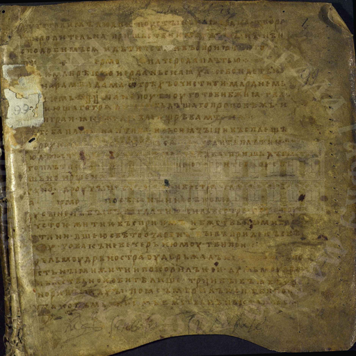
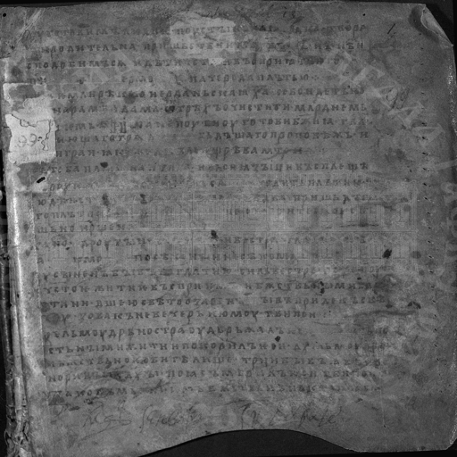
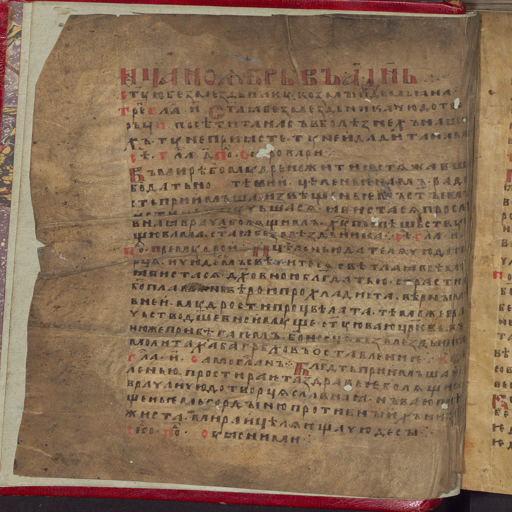
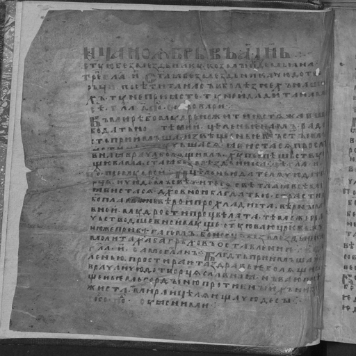
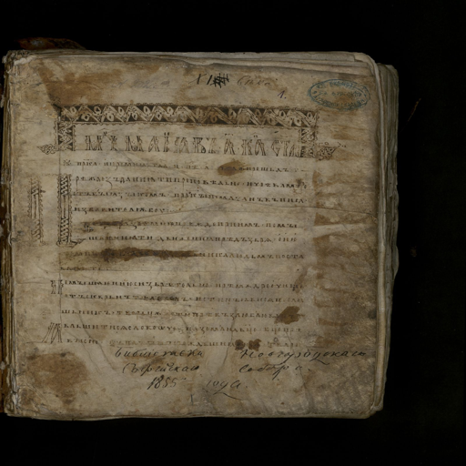
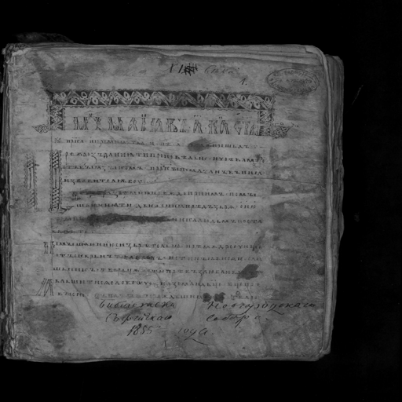
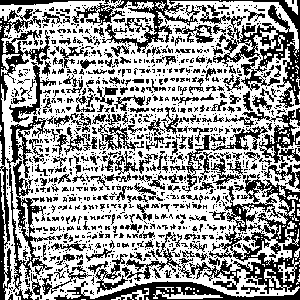
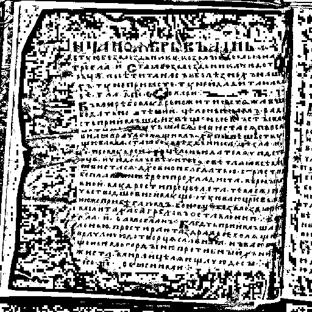
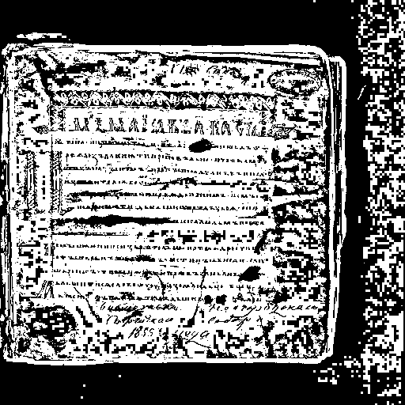

# Лабораторная работа №2 (Вариант 5)

## Обесцвечивание и бинаризация растровых изображений

---

# Задание 1

## Приведение к полутоновому изображению

Для перевода изображения в градации серого использовалась формула:

```
Y = 0.3R + 0.59G + 0.11B
```

---

## Результаты

### Изображение 1

**До:**


**После:**


---

### Изображение 2

**До:**


**После:**


---

### Изображение 3

**До:**


**После:**


---

# Задание 2

## Бинаризация изображения

**Метод: адаптивная бинаризация Айквила**

---

## Принцип работы

Метод Айквила использует:

* малое окно: **3×3**
* большое окно: **15×15**

Алгоритм:

1. Для большого окна вычисляется порог методом Отсу
2. Изображение делится на два класса
3. Если различие между классами значительное, то применяется бинаризация, иначе пиксели заменяются значением ближайшего класса

---

## Результаты

### Изображение 1

**Полутон:**


**Бинаризация:**


---

### Изображение 2

**Полутон:**


**Бинаризация:**


---

### Изображение 3

**Полутон:**


**Бинаризация:**


---