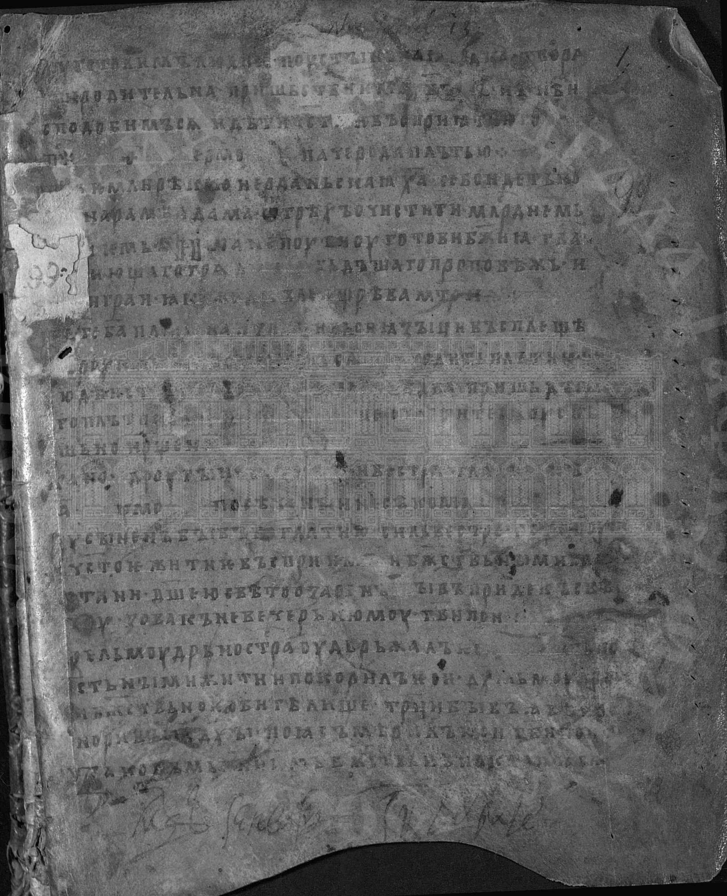
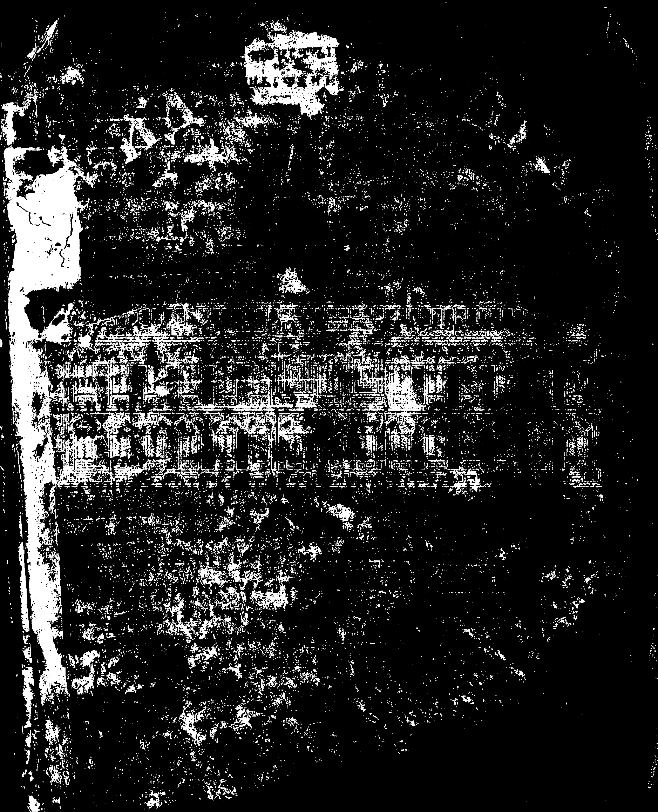
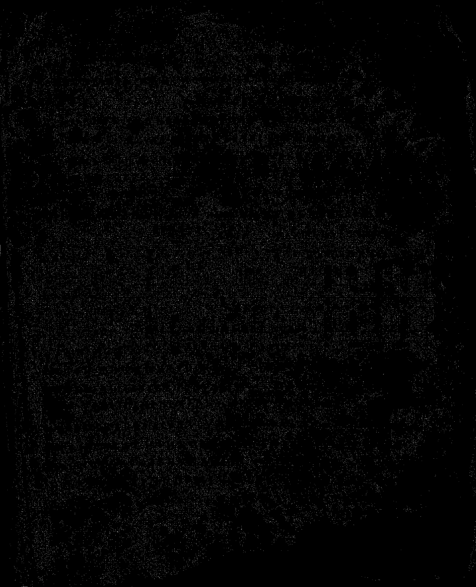
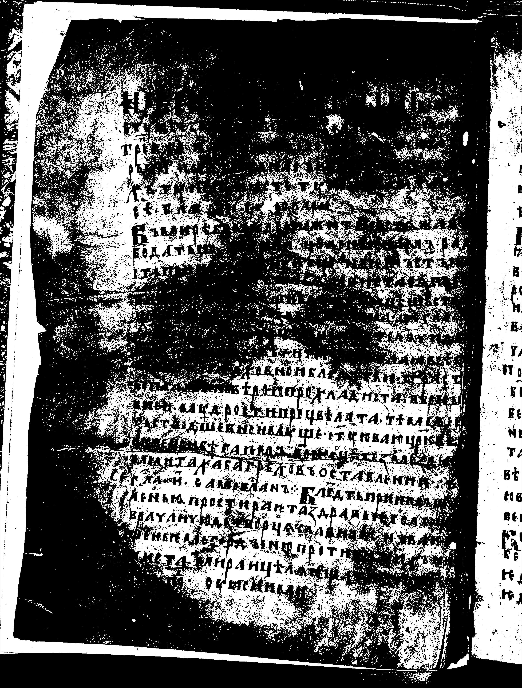
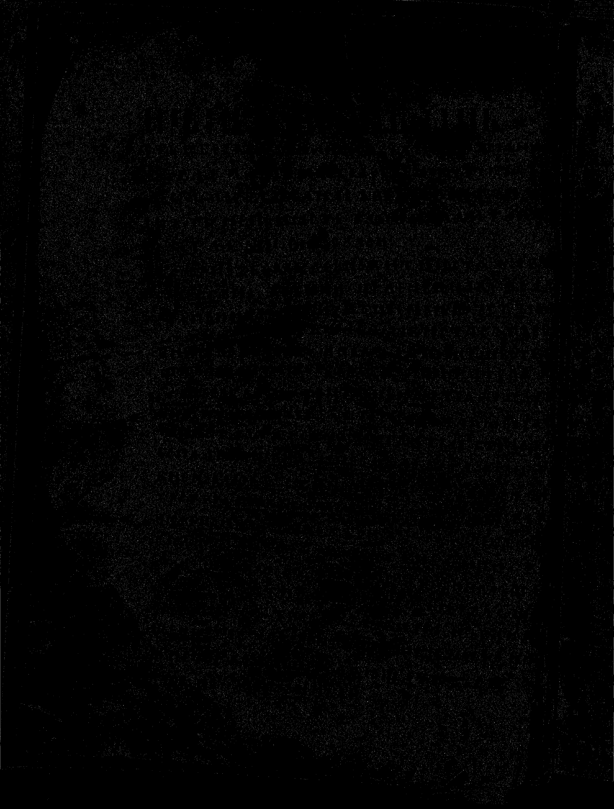
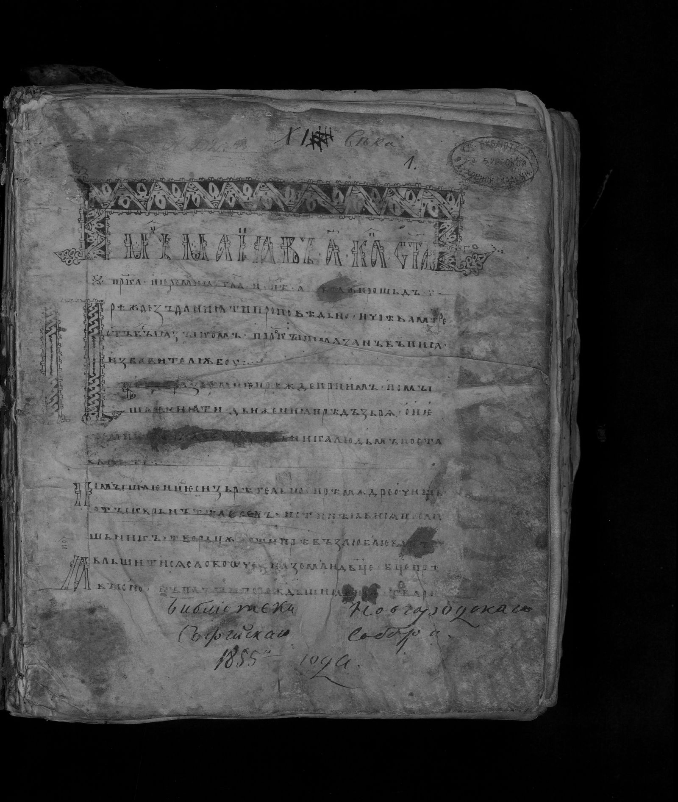
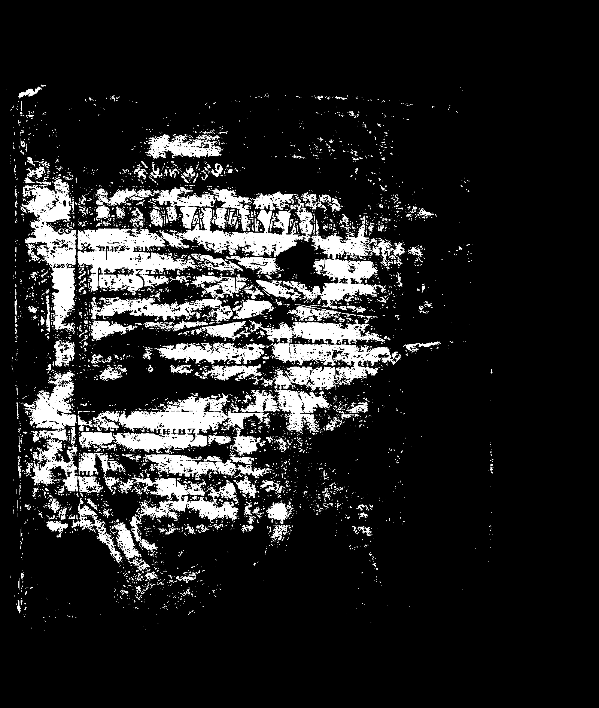
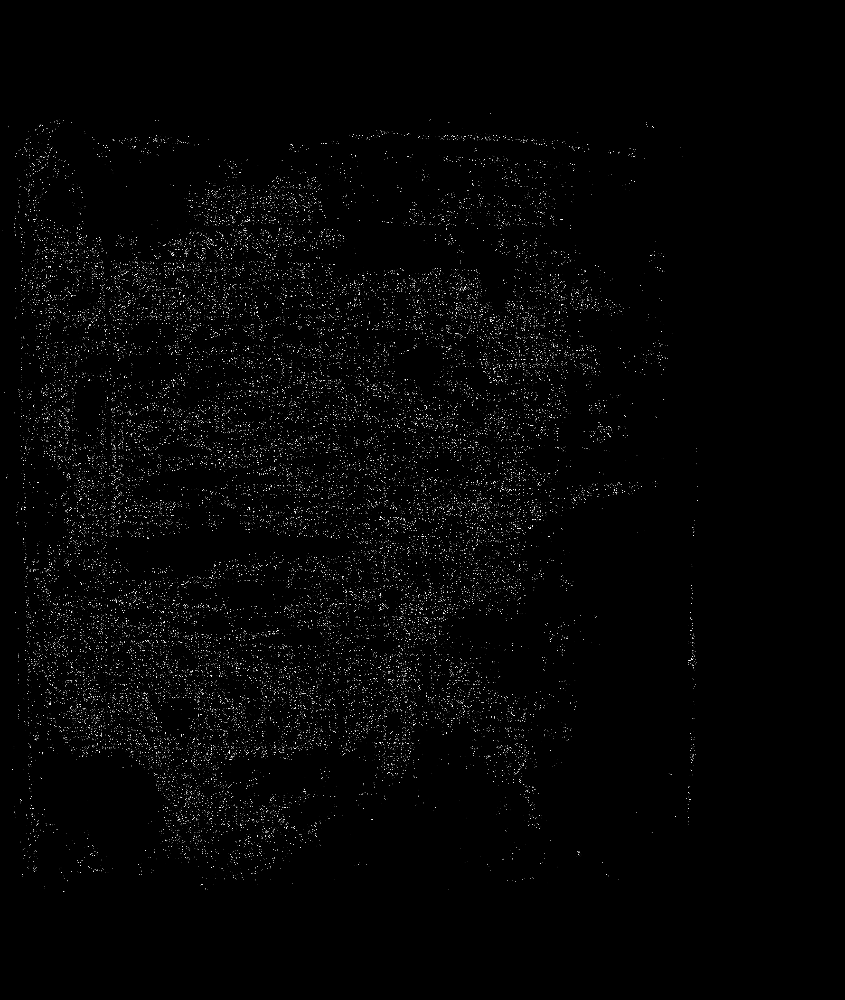

# Лабораторная работа №3 (Вариант 5)

## Фильтрация изображений и морфологические операции

---

# Используемый метод

## Медианный фильтр с разреженной маской (прямой крест)

Маска фильтра:
````
0 1 0
1 1 1
0 1 0
````
Размер окна: **3×3**  
Количество элементов: **5**

---

## Принцип работы

Алгоритм фильтрации:

1. Изображение переводится в бинарный вид
2. Для каждого пикселя рассматривается окрестность по маске
3. Подсчитывается количество единиц в окне
4. Применяется правило ранга:
если сумма ≥ 3 → пиксель = 1
иначе → пиксель = 0
5. Таким образом реализуется ранговый фильтр с параметром **3/5**.

---

## Разностное изображение

Для оценки изменений используется операция XOR:
```
diff = original XOR filtered
```
Она показывает, какие пиксели изменились после фильтрации.

---

# Результаты

### Изображение 1

**До:**


**После фильтрации:**


**Разность:**


---

### Изображение 2

**До:**


**После фильтрации:**


**Разность:**


---

### Изображение 3

**До:**


**После фильтрации:**


**Разность:**


---