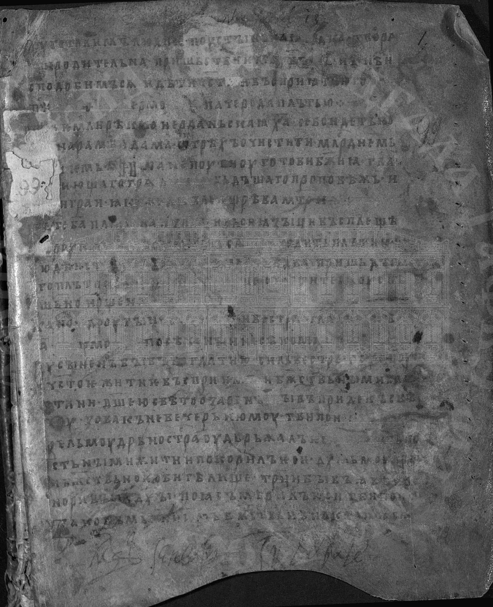
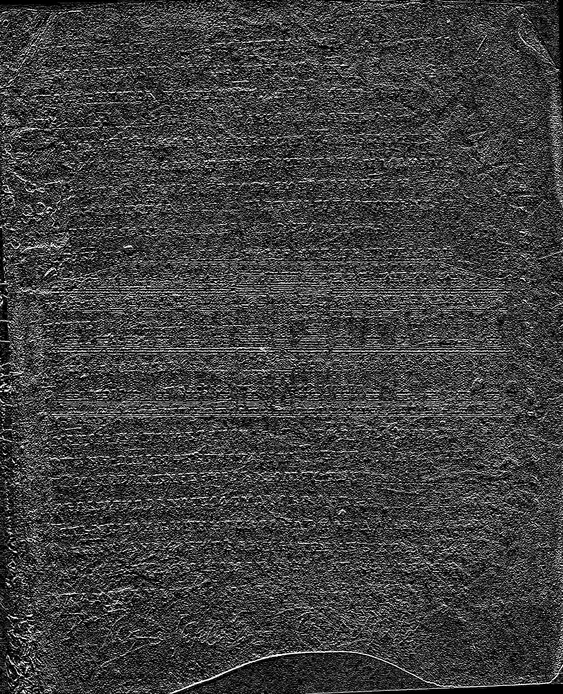
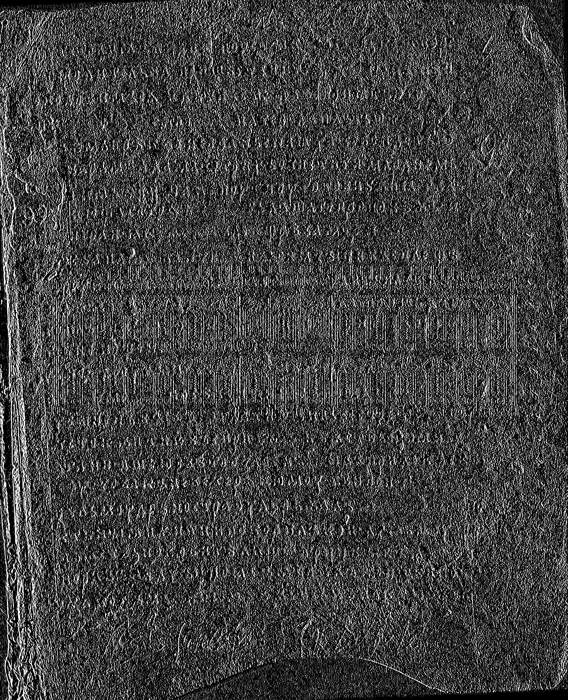
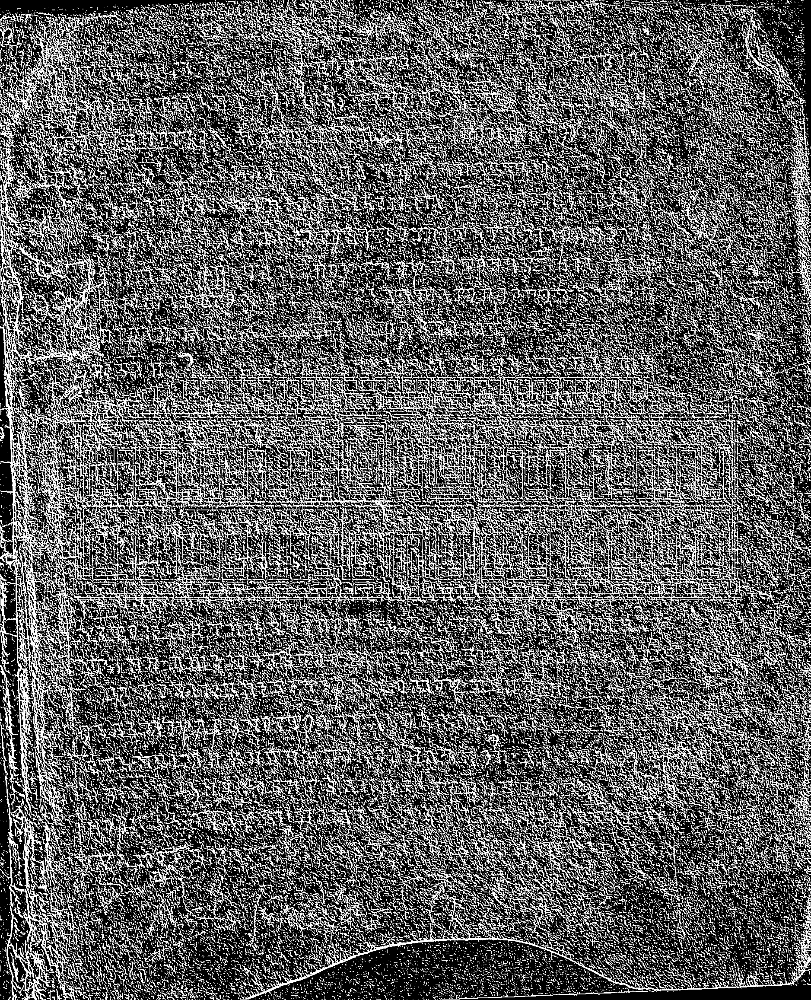

# Лабораторная работа №4 (Вариант 5)

## Выделение контуров на изображении

---

# Используемый метод

## Оператор Шарра

Матрицы оператора:

```
Gx =
 3  10   3
 0   0   0
-3 -10  -3
```

```
Gy =
-3   0   3
-10  0  10
-3   0   3
```

Размер окна: **3×3**

---

## Принцип работы

Алгоритм выделения контуров:

1. Исходное изображение переводится в полутоновое
2. Вычисляются частные производные:

   * **Gx** — по горизонтали
   * **Gy** — по вертикали
3. Вычисляется модуль градиента:

```
G = sqrt(Gx² + Gy²)
```

4. Все градиенты нормализуются
5. Выполняется бинаризация:

   * если G > T → пиксель = 255 (контур)
   * иначе → 0

---

# Результаты

### Изображение

**Исходное:**


**Полутоновое:**


---

### Градиенты

**Gx:**


**Gy:**


**Модуль градиента G:**


---

### Бинаризация

**Контурное изображение:**


---