# Лабораторная работа №5 (Вариант 5)

---

## Выделение признаков символов

---

**Вариант:** 5  
**Алфавит:** Кириллица (строчные)  

Скалярные характеристики получены автоматически из файла `features.csv`.

---

## Символ 1 — а

### Изображение символа

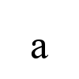

### Скалярные характеристики

| Признак | Значение |
|---|---:|
| Вес 1-й четверти | 41 |
| Вес 2-й четверти | 58 |
| Вес 3-й четверти | 61 |
| Вес 4-й четверти | 61 |
| Удельный вес 1-й четверти | 0.341667 |
| Удельный вес 2-й четверти | 0.483333 |
| Удельный вес 3-й четверти | 0.508333 |
| Удельный вес 4-й четверти | 0.508333 |
| Координата центра тяжести X | 9.380090 |
| Координата центра тяжести Y | 12.389140 |
| Нормированная координата X | 0.446671 |
| Нормированная координата Y | 0.516214 |
| Осевой момент инерции Ix | 11694.533937 |
| Осевой момент инерции Iy | 6880.072398 |
| Нормированный момент инерции Ix | 23.203440 |
| Нормированный момент инерции Iy | 13.650937 |

### Профиль X

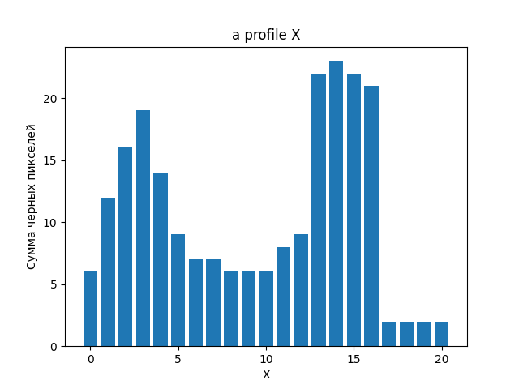

### Профиль Y

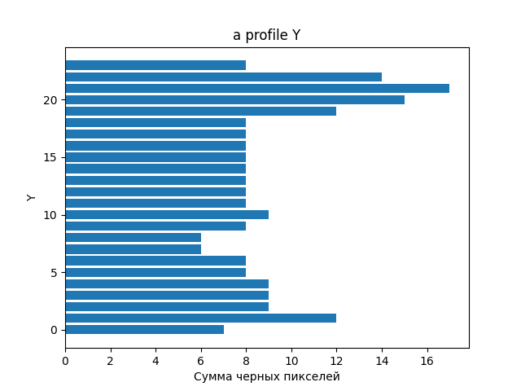

---
## Символ 2 — б

### Изображение символа

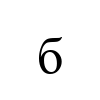

### Скалярные характеристики

| Признак | Значение |
|---|---:|
| Вес 1-й четверти | 62 |
| Вес 2-й четверти | 68 |
| Вес 3-й четверти | 90 |
| Вес 4-й четверти | 83 |
| Удельный вес 1-й четверти | 0.313131 |
| Удельный вес 2-й четверти | 0.343434 |
| Удельный вес 3-й четверти | 0.454545 |
| Удельный вес 4-й четверти | 0.419192 |
| Координата центра тяжести X | 10.656766 |
| Координата центра тяжести Y | 18.798680 |
| Нормированная координата X | 0.463338 |
| Нормированная координата Y | 0.508072 |
| Осевой момент инерции Ix | 34518.719472 |
| Осевой момент инерции Iy | 14904.303630 |
| Нормированный момент инерции Ix | 40.562538 |
| Нормированный момент инерции Iy | 17.513870 |

### Профиль X

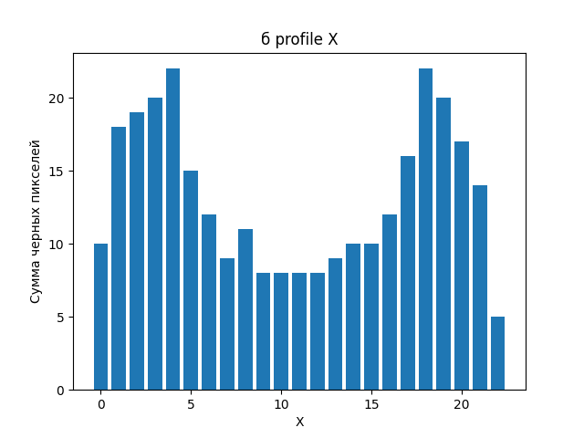

### Профиль Y

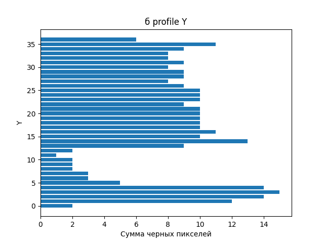

---
## Символ 3 — в

### Изображение символа

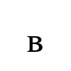

### Скалярные характеристики

| Признак | Значение |
|---|---:|
| Вес 1-й четверти | 62 |
| Вес 2-й четверти | 56 |
| Вес 3-й четверти | 56 |
| Вес 4-й четверти | 62 |
| Удельный вес 1-й четверти | 0.512397 |
| Удельный вес 2-й четверти | 0.462810 |
| Удельный вес 3-й четверти | 0.462810 |
| Удельный вес 4-й четверти | 0.512397 |
| Координата центра тяжести X | 10.919492 |
| Координата центра тяжести Y | 10.605932 |
| Нормированная координата X | 0.496341 |
| Нормированная координата Y | 0.482088 |
| Осевой момент инерции Ix | 10878.351695 |
| Осевой момент инерции Iy | 7749.470339 |
| Нормированный момент инерции Ix | 22.475933 |
| Нормированный момент инерции Iy | 16.011302 |

### Профиль X

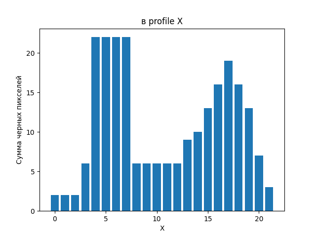

### Профиль Y

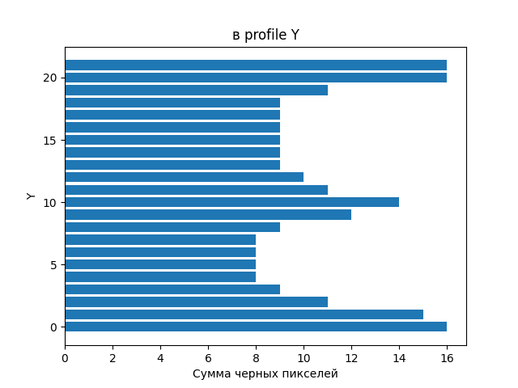

---
## Символ 4 — г

### Изображение символа

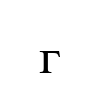

### Скалярные характеристики

| Признак | Значение |
|---|---:|
| Вес 1-й четверти | 54 |
| Вес 2-й четверти | 25 |
| Вес 3-й четверти | 53 |
| Вес 4-й четверти | 1 |
| Удельный вес 1-й четверти | 0.490909 |
| Удельный вес 2-й четверти | 0.227273 |
| Удельный вес 3-й четверти | 0.481818 |
| Удельный вес 4-й четверти | 0.009091 |
| Координата центра тяжести X | 7.195489 |
| Координата центра тяжести Y | 8.774436 |
| Нормированная координата X | 0.359774 |
| Нормированная координата Y | 0.398838 |
| Осевой момент инерции Ix | 7351.233083 |
| Осевой момент инерции Iy | 2540.917293 |
| Нормированный момент инерции Ix | 16.707348 |
| Нормированный момент инерции Iy | 5.774812 |

### Профиль X

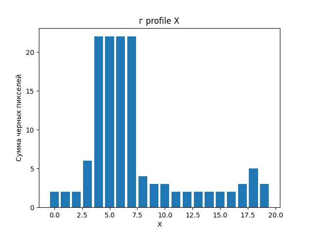

### Профиль Y

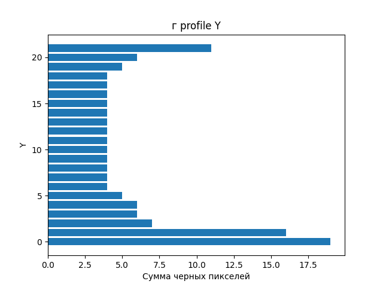

---
## Символ 5 — д

### Изображение символа

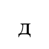

### Скалярные характеристики

| Признак | Значение |
|---|---:|
| Вес 1-й четверти | 32 |
| Вес 2-й четверти | 70 |
| Вес 3-й четверти | 45 |
| Вес 4-й четверти | 60 |
| Удельный вес 1-й четверти | 0.190476 |
| Удельный вес 2-й четверти | 0.416667 |
| Удельный вес 3-й четверти | 0.267857 |
| Удельный вес 4-й четверти | 0.357143 |
| Координата центра тяжести X | 13.657005 |
| Координата центра тяжести Y | 12.579710 |
| Нормированная координата X | 0.569042 |
| Нормированная координата Y | 0.449275 |
| Осевой момент инерции Ix | 14352.434783 |
| Осевой момент инерции Iy | 9196.647343 |
| Нормированный момент инерции Ix | 21.357790 |
| Нормированный момент инерции Iy | 13.685487 |

### Профиль X

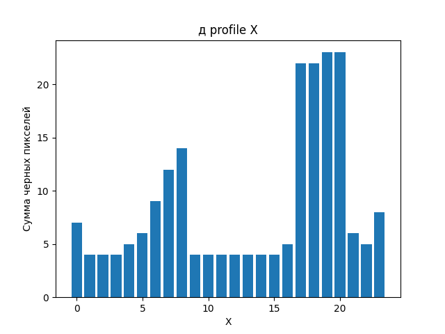

### Профиль Y

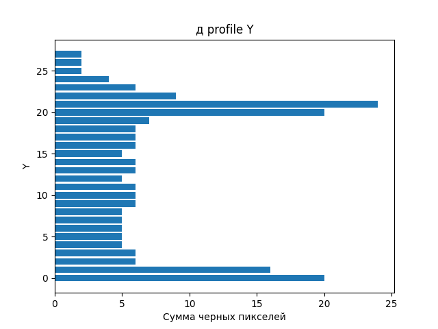

---
## Символ 6 — е

### Изображение символа

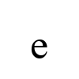

### Скалярные характеристики

| Признак | Значение |
|---|---:|
| Вес 1-й четверти | 54 |
| Вес 2-й четверти | 60 |
| Вес 3-й четверти | 60 |
| Вес 4-й четверти | 30 |
| Удельный вес 1-й четверти | 0.450000 |
| Удельный вес 2-й четверти | 0.500000 |
| Удельный вес 3-й четверти | 0.500000 |
| Удельный вес 4-й четверти | 0.250000 |
| Координата центра тяжести X | 8.519608 |
| Координата центра тяжести Y | 11.357843 |
| Нормированная координата X | 0.425980 |
| Нормированная координата Y | 0.473243 |
| Осевой момент инерции Ix | 10426.877451 |
| Осевой момент инерции Iy | 6474.921569 |
| Нормированный момент инерции Ix | 21.722661 |
| Нормированный момент инерции Iy | 13.489420 |

### Профиль X

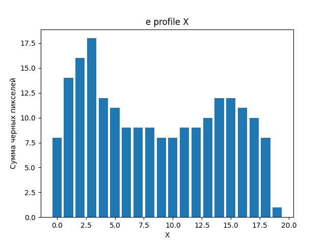

### Профиль Y

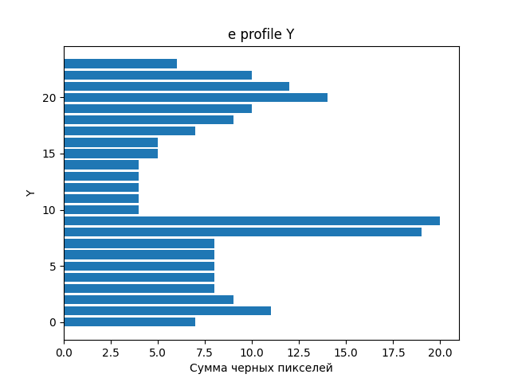

---
## Символ 7 — ж

### Изображение символа

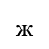

### Скалярные характеристики

| Признак | Значение |
|---|---:|
| Вес 1-й четверти | 76 |
| Вес 2-й четверти | 75 |
| Вес 3-й четверти | 84 |
| Вес 4-й четверти | 85 |
| Удельный вес 1-й четверти | 0.406417 |
| Удельный вес 2-й четверти | 0.401070 |
| Удельный вес 3-й четверти | 0.449198 |
| Удельный вес 4-й четверти | 0.454545 |
| Координата центра тяжести X | 16.475000 |
| Координата центра тяжести Y | 10.606250 |
| Нормированная координата X | 0.484559 |
| Нормированная координата Y | 0.482102 |
| Осевой момент инерции Ix | 15772.387500 |
| Осевой момент инерции Iy | 24219.800000 |
| Нормированный момент инерции Ix | 21.086080 |
| Нормированный момент инерции Iy | 32.379412 |

### Профиль X

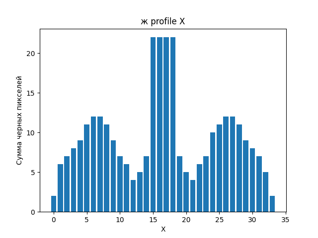

### Профиль Y

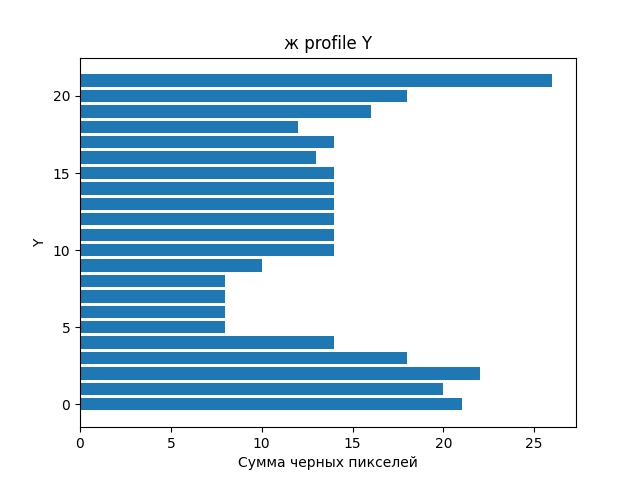

---
## Символ 8 — ѕ

### Изображение символа

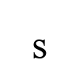

### Скалярные характеристики

| Признак | Значение |
|---|---:|
| Вес 1-й четверти | 49 |
| Вес 2-й четверти | 35 |
| Вес 3-й четверти | 27 |
| Вес 4-й четверти | 53 |
| Удельный вес 1-й четверти | 0.583333 |
| Удельный вес 2-й четверти | 0.416667 |
| Удельный вес 3-й четверти | 0.321429 |
| Удельный вес 4-й четверти | 0.630952 |
| Координата центра тяжести X | 7.000000 |
| Координата центра тяжести Y | 11.439024 |
| Нормированная координата X | 0.466667 |
| Нормированная координата Y | 0.476626 |
| Осевой момент инерции Ix | 8646.390244 |
| Осевой момент инерции Iy | 3482.000000 |
| Нормированный момент инерции Ix | 24.017751 |
| Нормированный момент инерции Iy | 9.672222 |

### Профиль X

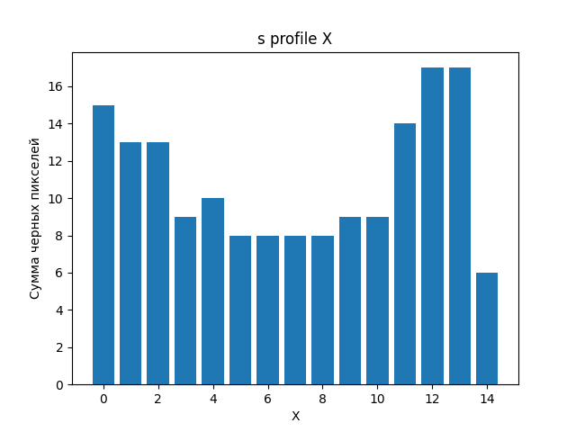

### Профиль Y

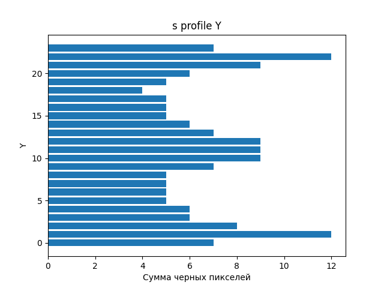

---
## Символ 9 — з

### Изображение символа

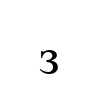

### Скалярные характеристики

| Признак | Значение |
|---|---:|
| Вес 1-й четверти | 29 |
| Вес 2-й четверти | 55 |
| Вес 3-й четверти | 15 |
| Вес 4-й четверти | 63 |
| Удельный вес 1-й четверти | 0.268519 |
| Удельный вес 2-й четверти | 0.509259 |
| Удельный вес 3-й четверти | 0.138889 |
| Удельный вес 4-й четверти | 0.583333 |
| Координата центра тяжести X | 10.586420 |
| Координата центра тяжести Y | 11.191358 |
| Нормированная координата X | 0.588134 |
| Нормированная координата Y | 0.466307 |
| Осевой момент инерции Ix | 9331.067901 |
| Осевой момент инерции Iy | 3373.290123 |
| Нормированный момент инерции Ix | 21.599694 |
| Нормированный момент инерции Iy | 7.808542 |

### Профиль X

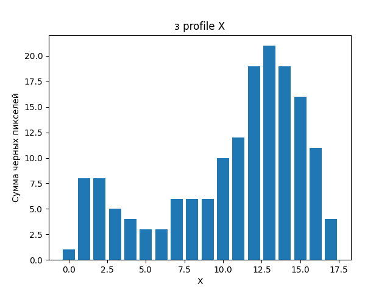

### Профиль Y

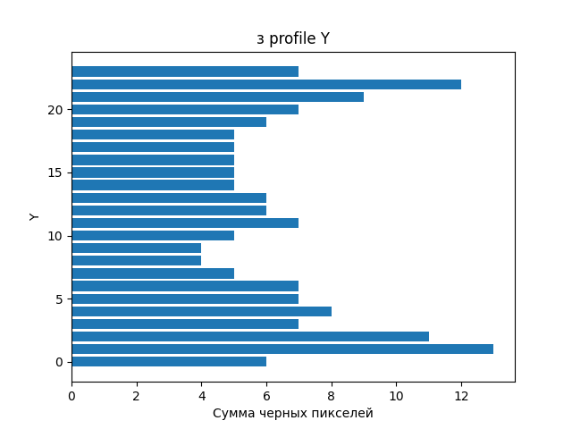

---
## Символ 10 — и

### Изображение символа

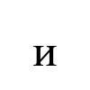

### Скалярные характеристики

| Признак | Значение |
|---|---:|
| Вес 1-й четверти | 55 |
| Вес 2-й четверти | 68 |
| Вес 3-й четверти | 68 |
| Вес 4-й четверти | 55 |
| Удельный вес 1-й четверти | 0.384615 |
| Удельный вес 2-й четверти | 0.475524 |
| Удельный вес 3-й четверти | 0.475524 |
| Удельный вес 4-й четверти | 0.384615 |
| Координата центра тяжести X | 12.447154 |
| Координата центра тяжести Y | 10.516260 |
| Нормированная координата X | 0.478737 |
| Нормированная координата Y | 0.478012 |
| Осевой момент инерции Ix | 11457.434959 |
| Осевой момент инерции Iy | 11846.813008 |
| Нормированный момент инерции Ix | 20.030481 |
| Нормированный момент инерции Iy | 20.711212 |

### Профиль X

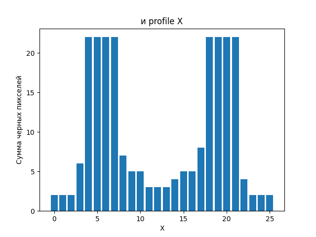

### Профиль Y

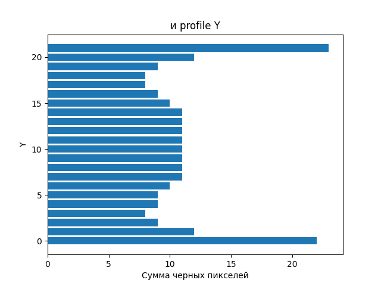

---
## Символ 11 — i

### Изображение символа

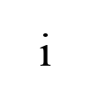

### Скалярные характеристики

| Признак | Значение |
|---|---:|
| Вес 1-й четверти | 19 |
| Вес 2-й четверти | 25 |
| Вес 3-й четверти | 40 |
| Вес 4-й четверти | 58 |
| Удельный вес 1-й четверти | 0.211111 |
| Удельный вес 2-й четверти | 0.277778 |
| Удельный вес 3-й четверти | 0.444444 |
| Удельный вес 4-й четверти | 0.644444 |
| Координата центра тяжести X | 4.887324 |
| Координата центра тяжести Y | 21.929577 |
| Нормированная координата X | 0.444302 |
| Нормированная координата Y | 0.609155 |
| Осевой момент инерции Ix | 13605.295775 |
| Осевой момент инерции Iy | 440.197183 |
| Нормированный момент инерции Ix | 34.356808 |
| Нормированный момент инерции Iy | 1.111609 |

### Профиль X

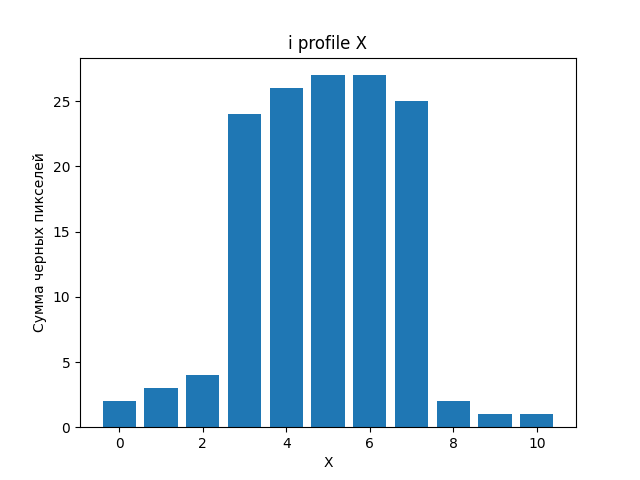

### Профиль Y

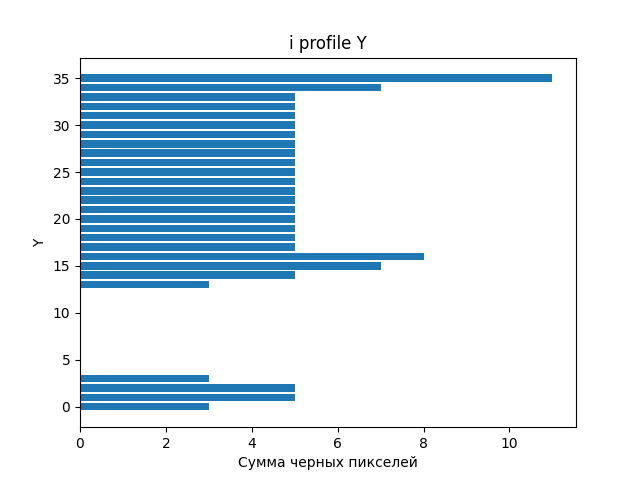

---
## Символ 12 — к

### Изображение символа

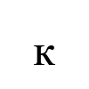

### Скалярные характеристики

| Признак | Значение |
|---|---:|
| Вес 1-й четверти | 63 |
| Вес 2-й четверти | 43 |
| Вес 3-й четверти | 58 |
| Вес 4-й четверти | 55 |
| Удельный вес 1-й четверти | 0.477273 |
| Удельный вес 2-й четверти | 0.325758 |
| Удельный вес 3-й четверти | 0.439394 |
| Удельный вес 4-й четверти | 0.416667 |
| Координата центра тяжести X | 10.707763 |
| Координата центра тяжести Y | 10.652968 |
| Нормированная координата X | 0.446157 |
| Нормированная координата Y | 0.484226 |
| Осевой момент инерции Ix | 10793.625571 |
| Осевой момент инерции Iy | 7693.296804 |
| Нормированный момент инерции Ix | 20.442473 |
| Нормированный момент инерции Iy | 14.570638 |

### Профиль X

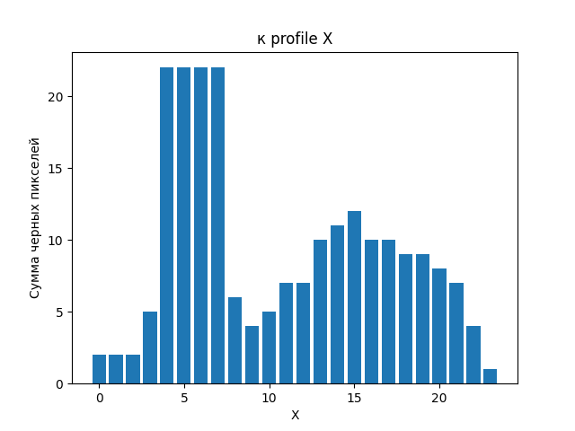

### Профиль Y

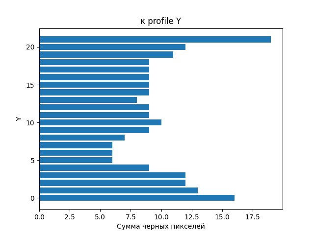

---
## Символ 13 — л

### Изображение символа

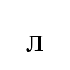

### Скалярные характеристики

| Признак | Значение |
|---|---:|
| Вес 1-й четверти | 27 |
| Вес 2-й четверти | 59 |
| Вес 3-й четверти | 41 |
| Вес 4-й четверти | 54 |
| Удельный вес 1-й четверти | 0.204545 |
| Удельный вес 2-й четверти | 0.446970 |
| Удельный вес 3-й четверти | 0.310606 |
| Удельный вес 4-й четверти | 0.409091 |
| Координата центра тяжести X | 13.668508 |
| Координата центра тяжести Y | 10.850829 |
| Нормированная координата X | 0.546740 |
| Нормированная координата Y | 0.471775 |
| Осевой момент инерции Ix | 10850.972376 |
| Осевой момент инерции Iy | 7410.110497 |
| Нормированный момент инерции Ix | 18.871256 |
| Нормированный момент инерции Iy | 12.887149 |

### Профиль X

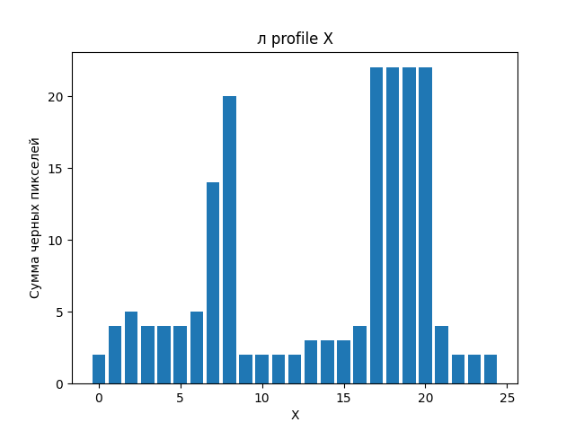

### Профиль Y

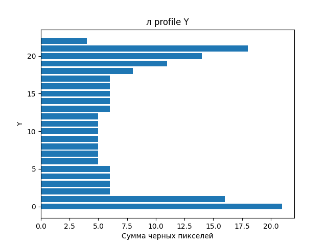

---
## Символ 14 — м

### Изображение символа

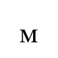

### Скалярные характеристики

| Признак | Значение |
|---|---:|
| Вес 1-й четверти | 71 |
| Вес 2-й четверти | 65 |
| Вес 3-й четверти | 69 |
| Вес 4-й четверти | 68 |
| Удельный вес 1-й четверти | 0.430303 |
| Удельный вес 2-й четверти | 0.393939 |
| Удельный вес 3-й четверти | 0.418182 |
| Удельный вес 4-й четверти | 0.412121 |
| Координата центра тяжести X | 15.263736 |
| Координата центра тяжести Y | 10.567766 |
| Нормированная координата X | 0.492379 |
| Нормированная координата Y | 0.480353 |
| Осевой момент инерции Ix | 11766.996337 |
| Осевой момент инерции Iy | 19889.010989 |
| Нормированный момент инерции Ix | 17.253660 |
| Нормированный момент инерции Iy | 29.162773 |

### Профиль X

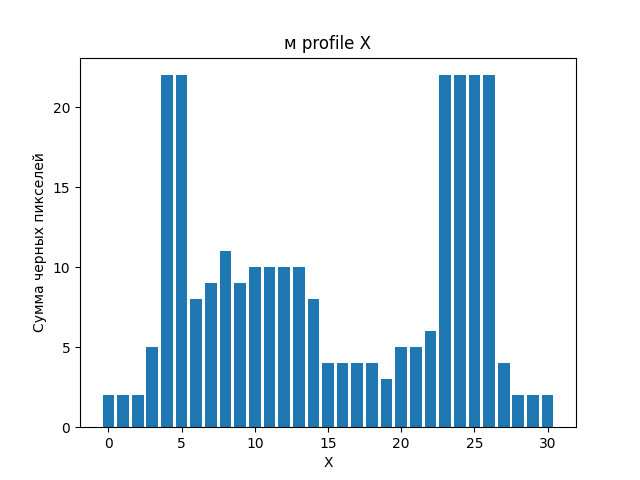

### Профиль Y

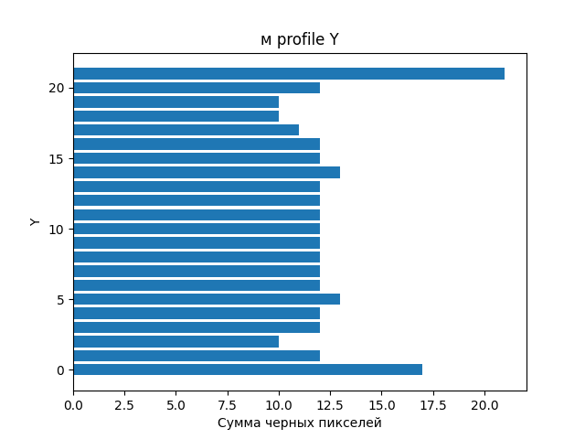

---
## Символ 15 — н

### Изображение символа

### Скалярные характеристики

| Признак | Значение |
|---|---:|
| Вес 1-й четверти | 63 |
| Вес 2-й четверти | 64 |
| Вес 3-й четверти | 54 |
| Вес 4-й четверти | 54 |
| Удельный вес 1-й четверти | 0.440559 |
| Удельный вес 2-й четверти | 0.447552 |
| Удельный вес 3-й четверти | 0.377622 |
| Удельный вес 4-й четверти | 0.377622 |
| Координата центра тяжести X | 12.472340 |
| Координата центра тяжести Y | 10.451064 |
| Нормированная координата X | 0.479705 |
| Нормированная координата Y | 0.475048 |
| Осевой момент инерции Ix | 11210.187234 |
| Осевой момент инерции Iy | 11656.570213 |
| Нормированный момент инерции Ix | 19.598229 |
| Нормированный момент инерции Iy | 20.378619 |

### Профиль X

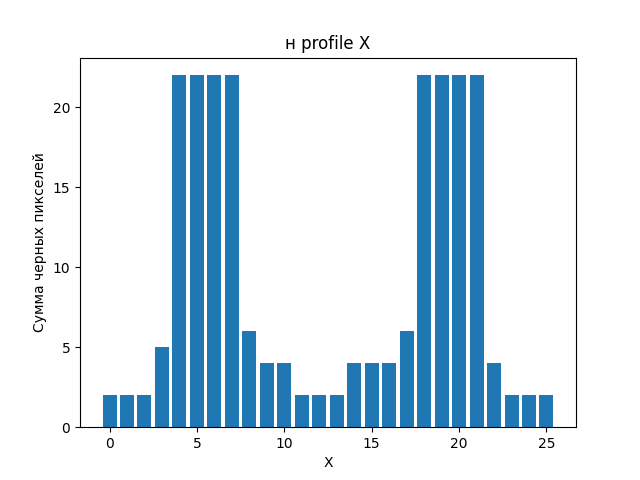

### Профиль Y

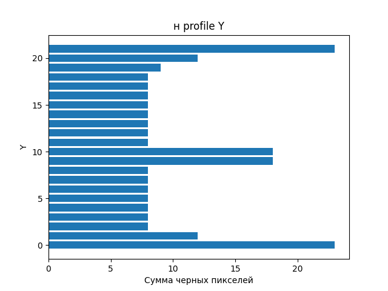

---
## Символ 16 — о

### Изображение символа

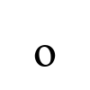

### Скалярные характеристики

| Признак | Значение |
|---|---:|
| Вес 1-й четверти | 49 |
| Вес 2-й четверти | 60 |
| Вес 3-й четверти | 61 |
| Вес 4-й четверти | 51 |
| Удельный вес 1-й четверти | 0.371212 |
| Удельный вес 2-й четверти | 0.454545 |
| Удельный вес 3-й четверти | 0.462121 |
| Удельный вес 4-й четверти | 0.386364 |
| Координата центра тяжести X | 10.583710 |
| Координата центра тяжести Y | 11.592760 |
| Нормированная координата X | 0.481078 |
| Нормированная координата Y | 0.483032 |
| Осевой момент инерции Ix | 10187.348416 |
| Осевой момент инерции Iy | 11269.701357 |
| Нормированный момент инерции Ix | 19.294220 |
| Нормированный момент инерции Iy | 21.344131 |

### Профиль X

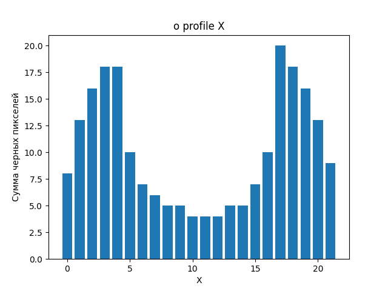

### Профиль Y

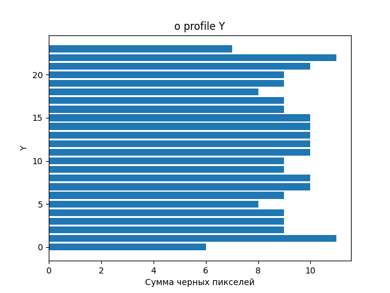

---
## Символ 17 — п

### Изображение символа

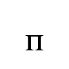

### Скалярные характеристики

| Признак | Значение |
|---|---:|
| Вес 1-й четверти | 59 |
| Вес 2-й четверти | 59 |
| Вес 3-й четверти | 54 |
| Вес 4-й четверти | 54 |
| Удельный вес 1-й четверти | 0.412587 |
| Удельный вес 2-й четверти | 0.412587 |
| Удельный вес 3-й четверти | 0.377622 |
| Удельный вес 4-й четверти | 0.377622 |
| Координата центра тяжести X | 12.464602 |
| Координата центра тяжести Y | 10.061947 |
| Нормированная координата X | 0.479408 |
| Нормированная координата Y | 0.457361 |
| Осевой момент инерции Ix | 12195.132743 |
| Осевой момент инерции Iy | 11536.216814 |
| Нормированный момент инерции Ix | 21.320162 |
| Нормированный момент инерции Iy | 20.168211 |

### Профиль X

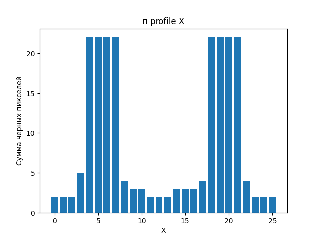

### Профиль Y

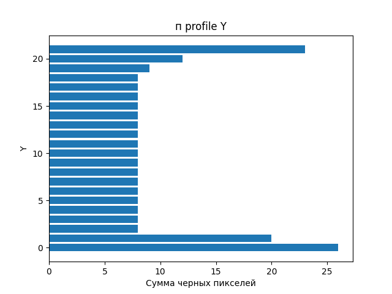

---
## Символ 18 — р

### Изображение символа

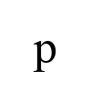

### Скалярные характеристики

| Признак | Значение |
|---|---:|
| Вес 1-й четверти | 82 |
| Вес 2-й четверти | 88 |
| Вес 3-й четверти | 88 |
| Вес 4-й четверти | 31 |
| Удельный вес 1-й четверти | 0.401961 |
| Удельный вес 2-й четверти | 0.431373 |
| Удельный вес 3-й четверти | 0.431373 |
| Удельный вес 4-й четверти | 0.151961 |
| Координата центра тяжести X | 11.141869 |
| Координата центра тяжести Y | 14.124567 |
| Нормированная координата X | 0.464245 |
| Нормированная координата Y | 0.415428 |
| Осевой момент инерции Ix | 27339.515571 |
| Осевой момент инерции Iy | 13745.183391 |
| Нормированный момент инерции Ix | 33.504308 |
| Нормированный момент инерции Iy | 16.844587 |

### Профиль X

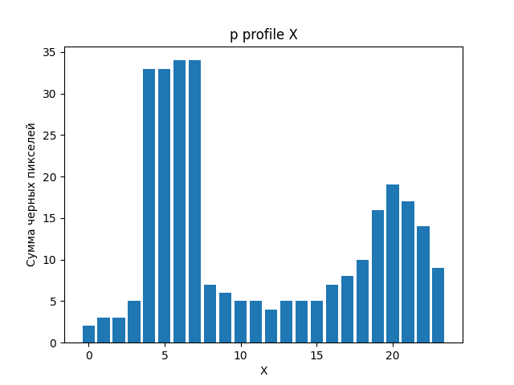

### Профиль Y

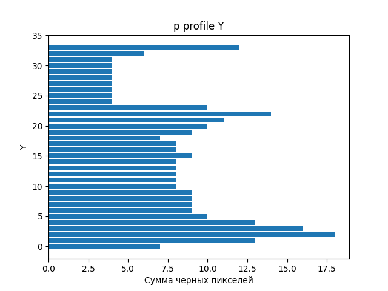

---
## Символ 19 — с

### Изображение символа

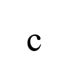

### Скалярные характеристики

| Признак | Значение |
|---|---:|
| Вес 1-й четверти | 41 |
| Вес 2-й четверти | 40 |
| Вес 3-й четверти | 59 |
| Вес 4-й четверти | 33 |
| Удельный вес 1-й четверти | 0.379630 |
| Удельный вес 2-й четверти | 0.370370 |
| Удельный вес 3-й четверти | 0.546296 |
| Удельный вес 4-й четверти | 0.305556 |
| Координата центра тяжести X | 7.786127 |
| Координата центра тяжести Y | 11.878613 |
| Нормированная координата X | 0.409796 |
| Нормированная координата Y | 0.494942 |
| Осевой момент инерции Ix | 9762.450867 |
| Осевой момент инерции Iy | 5515.086705 |
| Нормированный момент инерции Ix | 21.408883 |
| Нормированный момент инерции Iy | 12.094488 |

### Профиль X

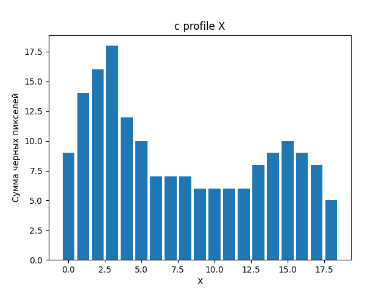

### Профиль Y

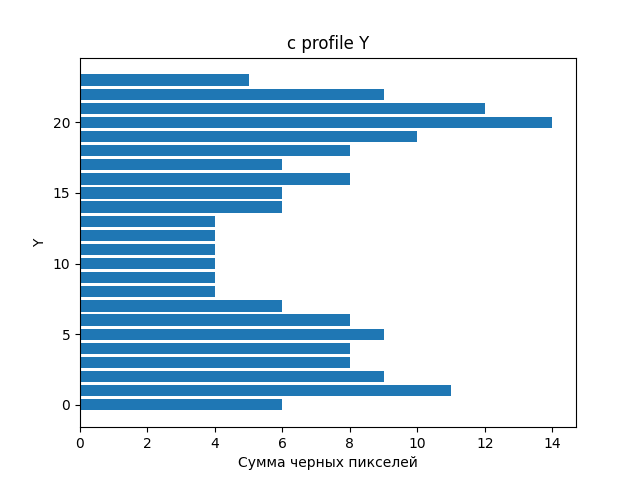

---
## Символ 20 — т

### Изображение символа

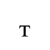

### Скалярные характеристики

| Признак | Значение |
|---|---:|
| Вес 1-й четверти | 46 |
| Вес 2-й четверти | 46 |
| Вес 3-й четверти | 27 |
| Вес 4-й четверти | 30 |
| Удельный вес 1-й четверти | 0.380165 |
| Удельный вес 2-й четверти | 0.380165 |
| Удельный вес 3-й четверти | 0.223140 |
| Удельный вес 4-й четверти | 0.247934 |
| Координата центра тяжести X | 10.624161 |
| Координата центра тяжести Y | 8.416107 |
| Нормированная координата X | 0.482916 |
| Нормированная координата Y | 0.382550 |
| Осевой момент инерции Ix | 8328.201342 |
| Осевой момент инерции Iy | 3108.953020 |
| Нормированный момент инерции Ix | 17.207028 |
| Нормированный момент инерции Iy | 6.423457 |

### Профиль X

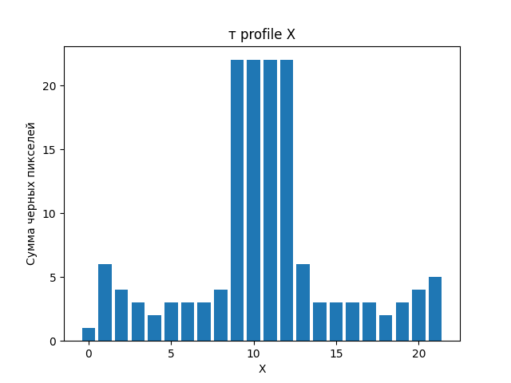

### Профиль Y

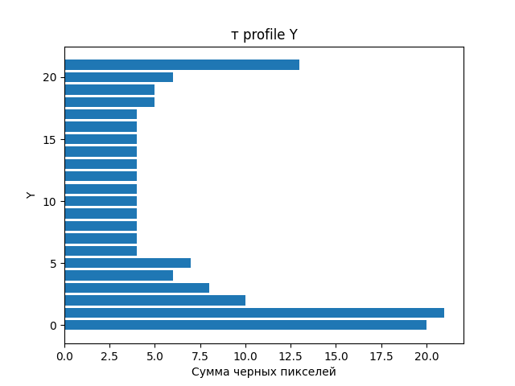

---
## Символ 21 — у

### Изображение символа

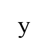

### Скалярные характеристики

| Признак | Значение |
|---|---:|
| Вес 1-й четверти | 79 |
| Вес 2-й четверти | 47 |
| Вес 3-й четверти | 45 |
| Вес 4-й четверти | 24 |
| Удельный вес 1-й четверти | 0.379808 |
| Удельный вес 2-й четверти | 0.225962 |
| Удельный вес 3-й четверти | 0.216346 |
| Удельный вес 4-й четверти | 0.115385 |
| Координата центра тяжести X | 11.158974 |
| Координата центра тяжести Y | 12.743590 |
| Нормированная координата X | 0.429191 |
| Нормированная координата Y | 0.386169 |
| Осевой момент инерции Ix | 19211.179487 |
| Осевой момент инерции Iy | 6298.071795 |
| Нормированный момент инерции Ix | 22.390652 |
| Нормированный момент инерции Iy | 7.340410 |

### Профиль X

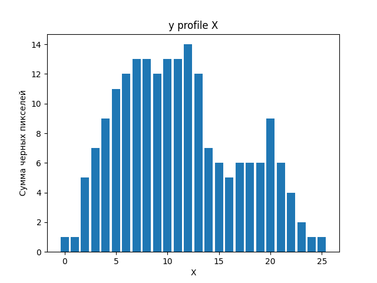

### Профиль Y

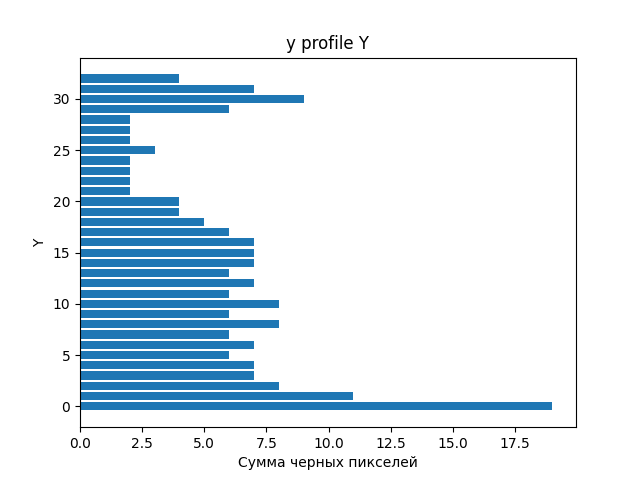

---
## Символ 22 — ф

### Изображение символа

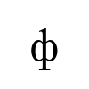

### Скалярные характеристики

| Признак | Значение |
|---|---:|
| Вес 1-й четверти | 81 |
| Вес 2-й четверти | 115 |
| Вес 3-й четверти | 97 |
| Вес 4-й четверти | 140 |
| Удельный вес 1-й четверти | 0.251553 |
| Удельный вес 2-й четверти | 0.357143 |
| Удельный вес 3-й четверти | 0.301242 |
| Удельный вес 4-й четверти | 0.434783 |
| Координата центра тяжести X | 14.182448 |
| Координата центра тяжести Y | 23.974596 |
| Нормированная координата X | 0.489050 |
| Нормированная координата Y | 0.510098 |
| Осевой момент инерции Ix | 54766.720554 |
| Осевой момент инерции Iy | 25444.586605 |
| Нормированный момент инерции Ix | 40.181013 |
| Нормированный момент инерции Iy | 18.668075 |

### Профиль X

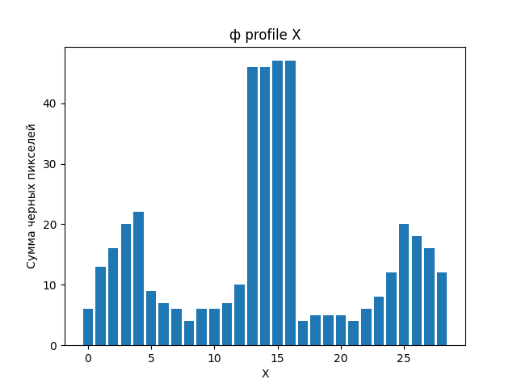

### Профиль Y

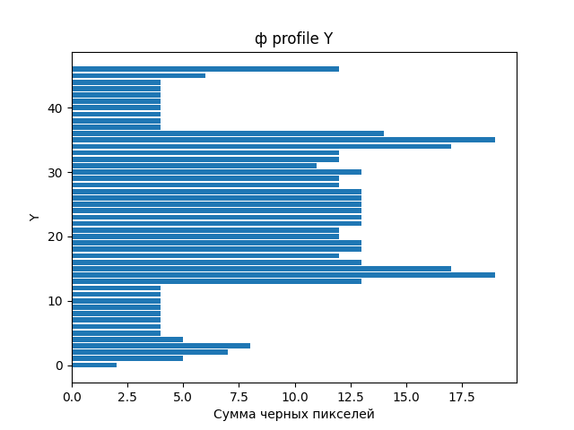

---
## Символ 23 — х

### Изображение символа

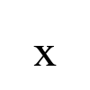

### Скалярные характеристики

| Признак | Значение |
|---|---:|
| Вес 1-й четверти | 61 |
| Вес 2-й четверти | 34 |
| Вес 3-й четверти | 35 |
| Вес 4-й четверти | 60 |
| Удельный вес 1-й четверти | 0.462121 |
| Удельный вес 2-й четверти | 0.257576 |
| Удельный вес 3-й четверти | 0.265152 |
| Удельный вес 4-й четверти | 0.454545 |
| Координата центра тяжести X | 11.089474 |
| Координата центра тяжести Y | 10.357895 |
| Нормированная координата X | 0.462061 |
| Нормированная координата Y | 0.470813 |
| Осевой момент инерции Ix | 10029.663158 |
| Осевой момент инерции Iy | 5613.478947 |
| Нормированный момент инерции Ix | 18.995574 |
| Нормированный момент инерции Iy | 10.631589 |

### Профиль X

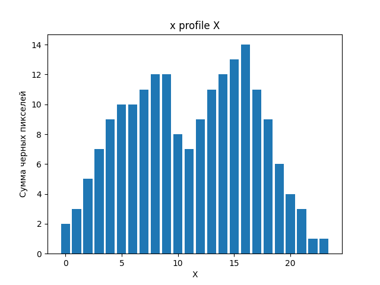

### Профиль Y

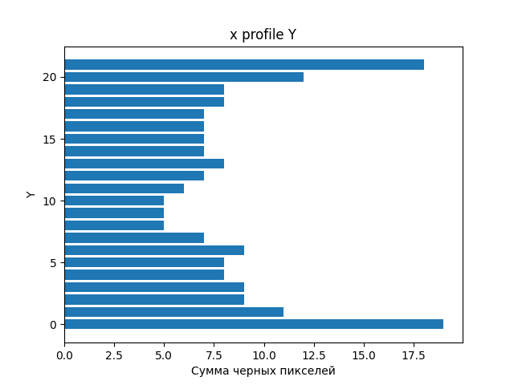

---
## Символ 24 — ц

### Изображение символа

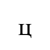

### Скалярные характеристики

| Признак | Значение |
|---|---:|
| Вес 1-й четверти | 65 |
| Вес 2-й четверти | 66 |
| Вес 3-й четверти | 48 |
| Вес 4-й четверти | 63 |
| Удельный вес 1-й четверти | 0.357143 |
| Удельный вес 2-й четверти | 0.362637 |
| Удельный вес 3-й четверти | 0.263736 |
| Удельный вес 4-й четверти | 0.346154 |
| Координата центра тяжести X | 13.206612 |
| Координата центра тяжести Y | 11.847107 |
| Нормированная координата X | 0.507947 |
| Нормированная координата Y | 0.423111 |
| Осевой момент инерции Ix | 14599.342975 |
| Осевой момент инерции Iy | 13453.669421 |
| Нормированный момент инерции Ix | 20.054043 |
| Нормированный момент инерции Iy | 18.480315 |

### Профиль X

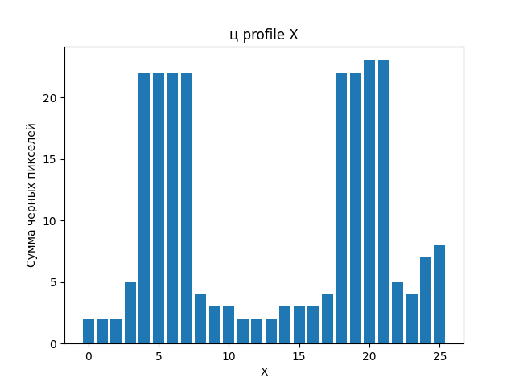

### Профиль Y

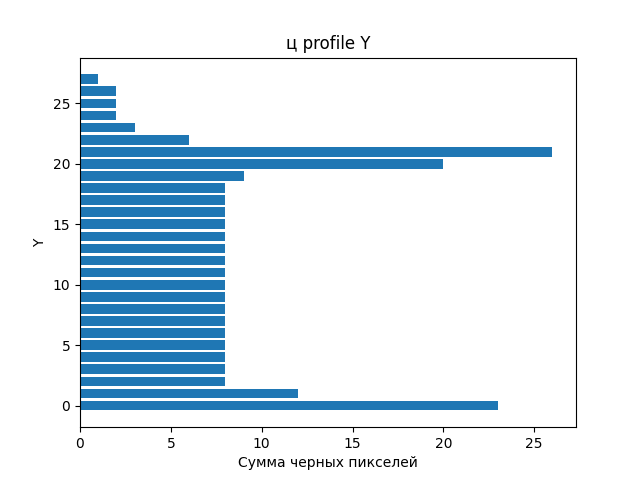

---
## Символ 25 — ч

### Изображение символа

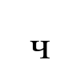

### Скалярные характеристики

| Признак | Значение |
|---|---:|
| Вес 1-й четверти | 54 |
| Вес 2-й четверти | 58 |
| Вес 3-й четверти | 15 |
| Вес 4-й четверти | 59 |
| Удельный вес 1-й четверти | 0.409091 |
| Удельный вес 2-й четверти | 0.439394 |
| Удельный вес 3-й четверти | 0.113636 |
| Удельный вес 4-й четверти | 0.446970 |
| Координата центра тяжести X | 12.978495 |
| Координата центра тяжести Y | 8.784946 |
| Нормированная координата X | 0.540771 |
| Нормированная координата Y | 0.399316 |
| Осевой момент инерции Ix | 8099.397849 |
| Осевой момент инерции Iy | 7297.913978 |
| Нормированный момент инерции Ix | 15.339769 |
| Нормированный момент инерции Iy | 13.821807 |

### Профиль X

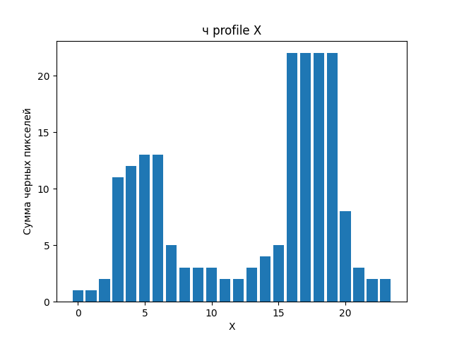

### Профиль Y

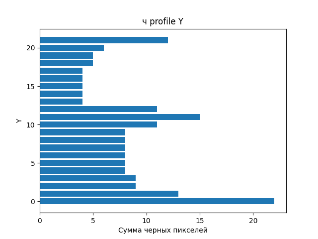

---
## Символ 26 — ш

### Изображение символа

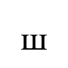

### Скалярные характеристики

| Признак | Значение |
|---|---:|
| Вес 1-й четверти | 80 |
| Вес 2-й четверти | 80 |
| Вес 3-й четверти | 91 |
| Вес 4-й четверти | 91 |
| Удельный вес 1-й четверти | 0.382775 |
| Удельный вес 2-й четверти | 0.382775 |
| Удельный вес 3-й четверти | 0.435407 |
| Удельный вес 4-й четверти | 0.435407 |
| Координата центра тяжести X | 18.529240 |
| Координата центра тяжести Y | 11.116959 |
| Нормированная координата X | 0.487612 |
| Нормированная координата Y | 0.505316 |
| Осевой момент инерции Ix | 18385.321637 |
| Осевой момент инерции Iy | 39059.207602 |
| Нормированный момент инерции Ix | 21.992012 |
| Нормированный момент инерции Iy | 46.721540 |

### Профиль X

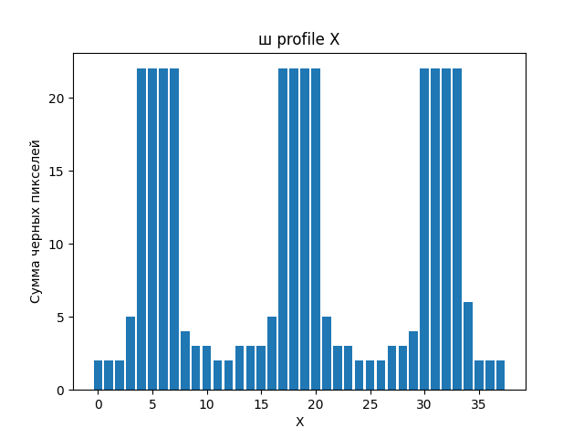

### Профиль Y

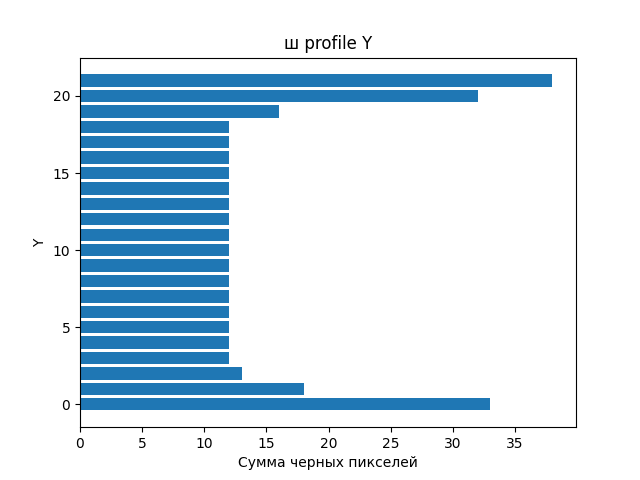

---
## Символ 27 — щ

### Изображение символа

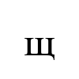

### Скалярные характеристики

| Признак | Значение |
|---|---:|
| Вес 1-й четверти | 98 |
| Вес 2-й четверти | 98 |
| Вес 3-й четверти | 73 |
| Вес 4-й четверти | 87 |
| Удельный вес 1-й четверти | 0.368421 |
| Удельный вес 2-й четверти | 0.368421 |
| Удельный вес 3-й четверти | 0.274436 |
| Удельный вес 4-й четверти | 0.327068 |
| Координата центра тяжести X | 19.213483 |
| Координата центра тяжести Y | 11.606742 |
| Нормированная координата X | 0.505618 |
| Нормированная координата Y | 0.414526 |
| Осевой момент инерции Ix | 20506.943820 |
| Осевой момент инерции Iy | 43151.775281 |
| Нормированный момент инерции Ix | 19.273443 |
| Нормированный момент инерции Iy | 40.556180 |

### Профиль X

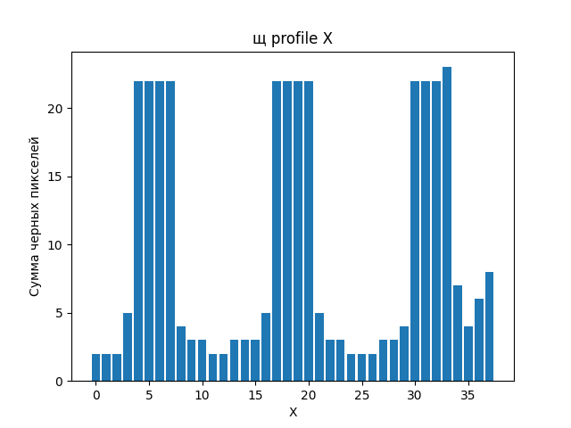

### Профиль Y

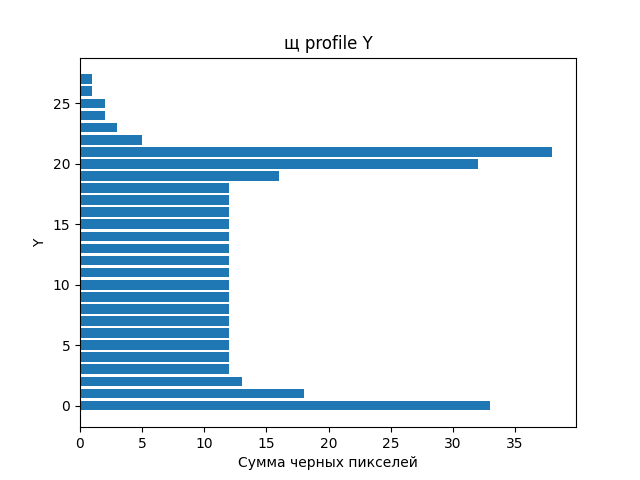

---
## Символ 28 — ъ

### Изображение символа

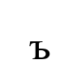

### Скалярные характеристики

| Признак | Значение |
|---|---:|
| Вес 1-й четверти | 66 |
| Вес 2-й четверти | 23 |
| Вес 3-й четверти | 50 |
| Вес 4-й четверти | 65 |
| Удельный вес 1-й четверти | 0.500000 |
| Удельный вес 2-й четверти | 0.174242 |
| Удельный вес 3-й четверти | 0.378788 |
| Удельный вес 4-й четверти | 0.492424 |
| Координата центра тяжести X | 12.691176 |
| Координата центра тяжести Y | 11.401961 |
| Нормированная координата X | 0.507647 |
| Нормированная координата Y | 0.518271 |
| Осевой момент инерции Ix | 9435.039216 |
| Осевой момент инерции Iy | 7793.544118 |
| Нормированный момент инерции Ix | 17.154617 |
| Нормированный момент инерции Iy | 14.170080 |

### Профиль X

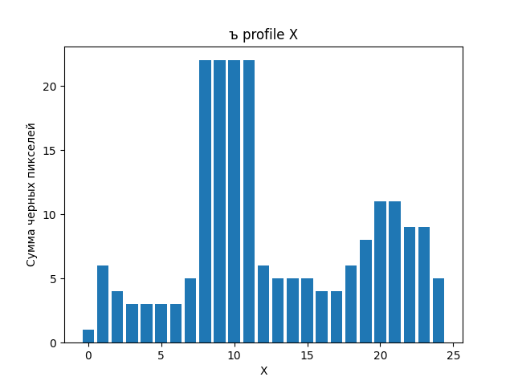

### Профиль Y

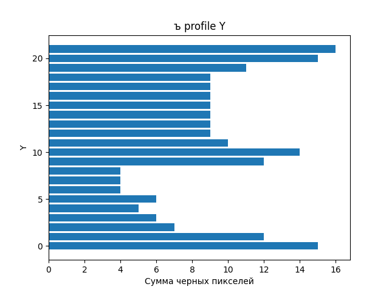

---
## Символ 29 — ы

### Изображение символа

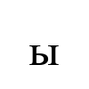

### Скалярные характеристики

| Признак | Значение |
|---|---:|
| Вес 1-й четверти | 71 |
| Вес 2-й четверти | 56 |
| Вес 3-й четверти | 74 |
| Вес 4-й четверти | 96 |
| Удельный вес 1-й четверти | 0.403409 |
| Удельный вес 2-й четверти | 0.318182 |
| Удельный вес 3-й четверти | 0.420455 |
| Удельный вес 4-й четверти | 0.545455 |
| Координата центра тяжести X | 15.740741 |
| Координата центра тяжести Y | 11.585859 |
| Нормированная координата X | 0.476992 |
| Нормированная координата Y | 0.526630 |
| Осевой момент инерции Ix | 13686.060606 |
| Осевой момент инерции Iy | 25761.037037 |
| Нормированный момент инерции Ix | 18.851323 |
| Нормированный момент инерции Iy | 35.483522 |

### Профиль X

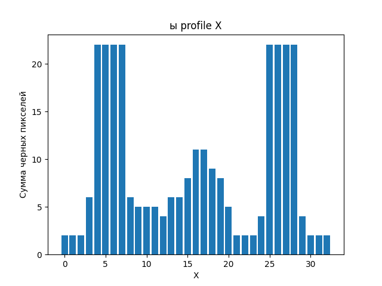

### Профиль Y

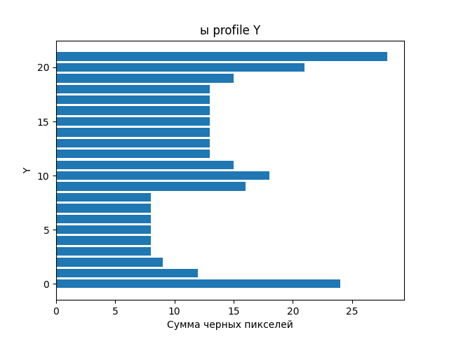

---
## Символ 30 — ь

### Изображение символа

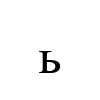

### Скалярные характеристики

| Признак | Значение |
|---|---:|
| Вес 1-й четверти | 56 |
| Вес 2-й четверти | 16 |
| Вес 3-й четверти | 54 |
| Вес 4-й четверти | 62 |
| Удельный вес 1-й четверти | 0.509091 |
| Удельный вес 2-й четверти | 0.145455 |
| Удельный вес 3-й четверти | 0.490909 |
| Удельный вес 4-й четверти | 0.563636 |
| Координата центра тяжести X | 9.627660 |
| Координата центра тяжести Y | 12.260638 |
| Нормированная координата X | 0.458460 |
| Нормированная координата Y | 0.557302 |
| Осевой момент инерции Ix | 7714.228723 |
| Осевой момент инерции Iy | 5659.936170 |
| Нормированный момент инерции Ix | 16.697465 |
| Нормированный момент инерции Iy | 12.250944 |

### Профиль X

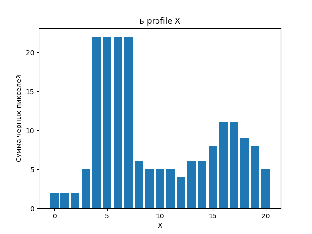

### Профиль Y

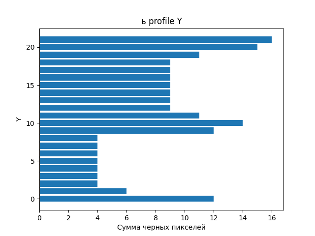

---
## Символ 31 — ѣ

### Изображение символа

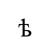

### Скалярные характеристики

| Признак | Значение |
|---|---:|
| Вес 1-й четверти | 104 |
| Вес 2-й четверти | 24 |
| Вес 3-й четверти | 81 |
| Вес 4-й четверти | 83 |
| Удельный вес 1-й четверти | 0.444444 |
| Удельный вес 2-й четверти | 0.102564 |
| Удельный вес 3-й четверти | 0.346154 |
| Удельный вес 4-й четверти | 0.354701 |
| Координата центра тяжести X | 12.410959 |
| Координата центра тяжести Y | 20.113014 |
| Нормированная координата X | 0.477345 |
| Нормированная координата Y | 0.558695 |
| Осевой момент инерции Ix | 30225.270548 |
| Осевой момент инерции Iy | 10542.684932 |
| Нормированный момент инерции Ix | 32.291956 |
| Нормированный момент инерции Iy | 11.263552 |

### Профиль X

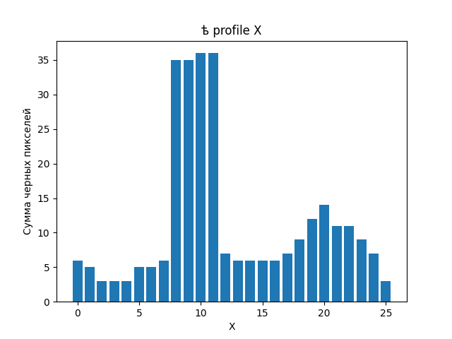

### Профиль Y

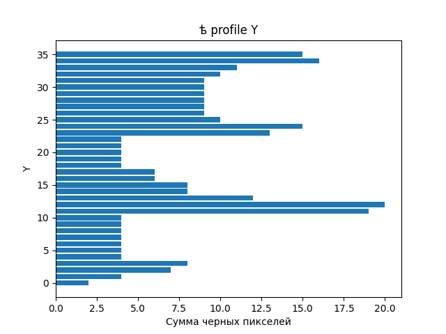

---
## Символ 32 — ю

### Изображение символа

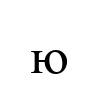

### Скалярные характеристики

| Признак | Значение |
|---|---:|
| Вес 1-й четверти | 95 |
| Вес 2-й четверти | 79 |
| Вес 3-й четверти | 83 |
| Вес 4-й четверти | 80 |
| Удельный вес 1-й четверти | 0.439815 |
| Удельный вес 2-й четверти | 0.365741 |
| Удельный вес 3-й четверти | 0.384259 |
| Удельный вес 4-й четверти | 0.370370 |
| Координата центра тяжести X | 17.816024 |
| Координата центра тяжести Y | 11.474777 |
| Нормированная координата X | 0.494890 |
| Нормированная координата Y | 0.478116 |
| Осевой момент инерции Ix | 15740.035608 |
| Осевой момент инерции Iy | 38404.593472 |
| Нормированный момент инерции Ix | 18.217634 |
| Нормированный момент инерции Iy | 44.449761 |

### Профиль X

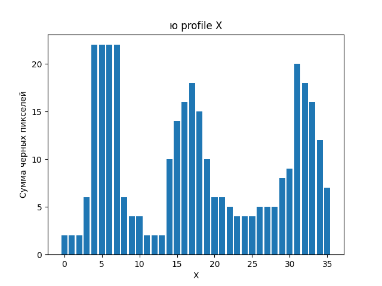

### Профиль Y

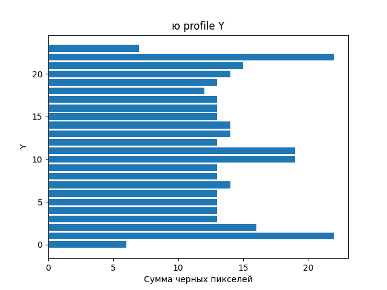

---
## Символ 33 — ѵ

### Изображение символа

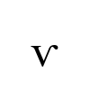

### Скалярные характеристики

| Признак | Значение |
|---|---:|
| Вес 1-й четверти | 59 |
| Вес 2-й четверти | 44 |
| Вес 3-й четверти | 46 |
| Вес 4-й четверти | 14 |
| Удельный вес 1-й четверти | 0.327778 |
| Удельный вес 2-й четверти | 0.244444 |
| Удельный вес 3-й четверти | 0.255556 |
| Удельный вес 4-й четверти | 0.077778 |
| Координата центра тяжести X | 13.368098 |
| Координата центра тяжести Y | 8.944785 |
| Нормированная координата X | 0.445603 |
| Нормированная координата Y | 0.372699 |
| Осевой момент инерции Ix | 6886.503067 |
| Осевой момент инерции Iy | 8519.914110 |
| Нормированный момент инерции Ix | 9.564588 |
| Нормированный момент инерции Iy | 11.833214 |

### Профиль X

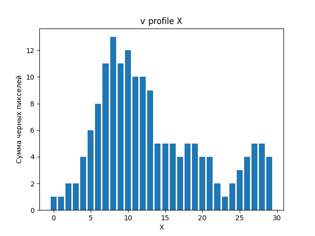

### Профиль Y

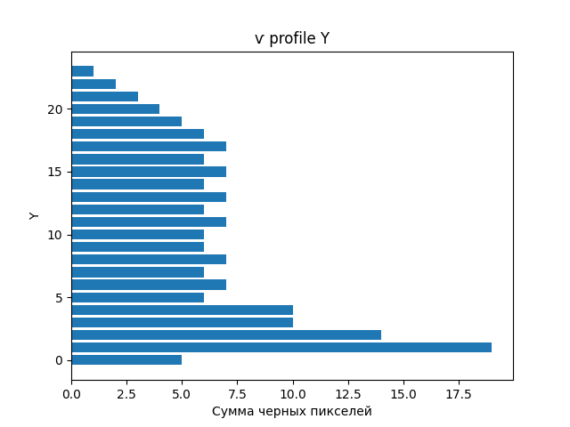

---
## Символ 34 — ѯ

### Изображение символа

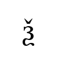

### Скалярные характеристики

| Признак | Значение |
|---|---:|
| Вес 1-й четверти | 47 |
| Вес 2-й четверти | 69 |
| Вес 3-й четверти | 70 |
| Вес 4-й четверти | 94 |
| Удельный вес 1-й четверти | 0.204348 |
| Удельный вес 2-й четверти | 0.300000 |
| Удельный вес 3-й четверти | 0.304348 |
| Удельный вес 4-й четверти | 0.408696 |
| Координата центра тяжести X | 10.017857 |
| Координата центра тяжести Y | 26.214286 |
| Нормированная координата X | 0.500893 |
| Нормированная координата Y | 0.557751 |
| Осевой момент инерции Ix | 50933.142857 |
| Осевой момент инерции Iy | 7786.910714 |
| Нормированный момент инерции Ix | 54.184195 |
| Нормированный момент инерции Iy | 8.283948 |

### Профиль X

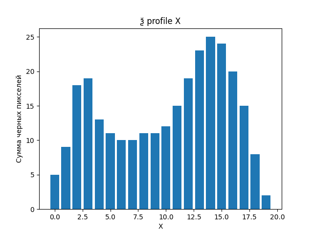

### Профиль Y

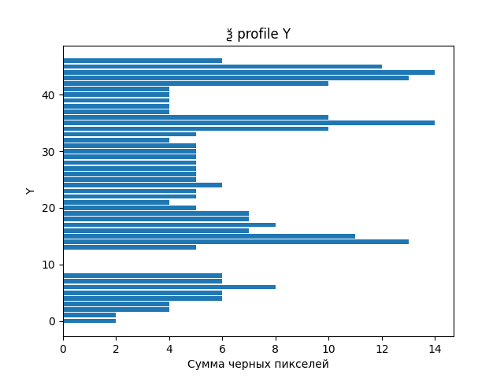

---
## Символ 35 — ѱ

### Изображение символа

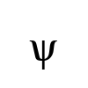

### Скалярные характеристики

| Признак | Значение |
|---|---:|
| Вес 1-й четверти | 90 |
| Вес 2-й четверти | 107 |
| Вес 3-й четверти | 52 |
| Вес 4-й четверти | 59 |
| Удельный вес 1-й четверти | 0.375000 |
| Удельный вес 2-й четверти | 0.445833 |
| Удельный вес 3-й четверти | 0.216667 |
| Удельный вес 4-й четверти | 0.245833 |
| Координата центра тяжести X | 14.792208 |
| Координата центра тяжести Y | 12.477273 |
| Нормированная координата X | 0.477168 |
| Нормированная координата Y | 0.378099 |
| Осевой момент инерции Ix | 19760.840909 |
| Осевой момент инерции Iy | 16718.701299 |
| Нормированный момент инерции Ix | 19.316560 |
| Нормированный момент инерции Iy | 16.342817 |

### Профиль X

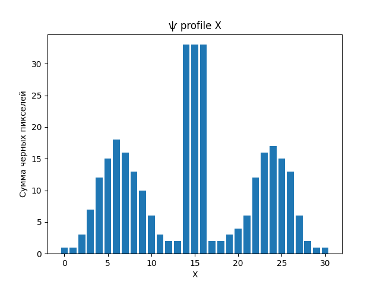

### Профиль Y

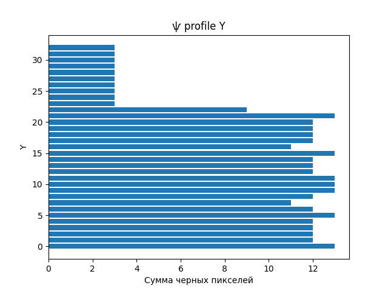

---
## Символ 36 — ѡ

### Изображение символа

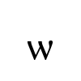

### Скалярные характеристики

| Признак | Значение |
|---|---:|
| Вес 1-й четверти | 59 |
| Вес 2-й четверти | 83 |
| Вес 3-й четверти | 59 |
| Вес 4-й четверти | 58 |
| Удельный вес 1-й четверти | 0.327778 |
| Удельный вес 2-й четверти | 0.461111 |
| Удельный вес 3-й четверти | 0.327778 |
| Удельный вес 4-й четверти | 0.322222 |
| Координата центра тяжести X | 14.872587 |
| Координата центра тяжести Y | 10.525097 |
| Нормированная координата X | 0.479761 |
| Нормированная координата Y | 0.438546 |
| Осевой момент инерции Ix | 9772.586873 |
| Осевой момент инерции Iy | 19518.795367 |
| Нормированный момент инерции Ix | 13.135197 |
| Нормированный момент инерции Iy | 26.234940 |

### Профиль X

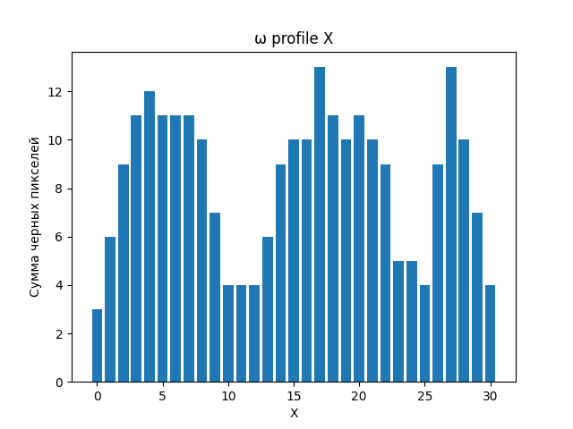

### Профиль Y

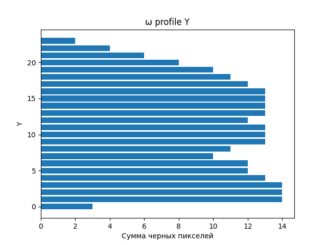

---
## Символ 37 — ѳ

### Изображение символа

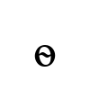

### Скалярные характеристики

| Признак | Значение |
|---|---:|
| Вес 1-й четверти | 69 |
| Вес 2-й четверти | 69 |
| Вес 3-й четверти | 63 |
| Вес 4-й четверти | 60 |
| Удельный вес 1-й четверти | 0.522727 |
| Удельный вес 2-й четверти | 0.522727 |
| Удельный вес 3-й четверти | 0.477273 |
| Удельный вес 4-й четверти | 0.454545 |
| Координата центра тяжести X | 10.467433 |
| Координата центра тяжести Y | 11.390805 |
| Нормированная координата X | 0.475792 |
| Нормированная координата Y | 0.474617 |
| Осевой момент инерции Ix | 10526.137931 |
| Осевой момент инерции Iy | 11710.973180 |
| Нормированный момент инерции Ix | 19.935867 |
| Нормированный момент инерции Iy | 22.179873 |

### Профиль X

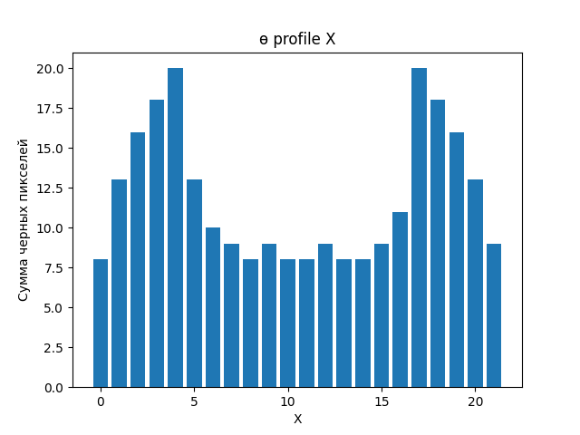

### Профиль Y

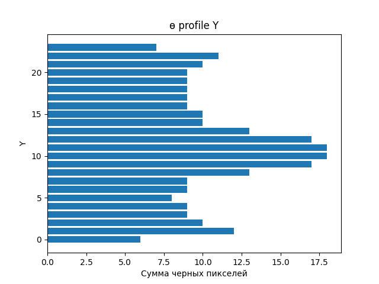

---
## Символ 38 — ѧ

### Изображение символа

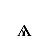

### Скалярные характеристики

| Признак | Значение |
|---|---:|
| Вес 1-й четверти | 22 |
| Вес 2-й четверти | 35 |
| Вес 3-й четверти | 69 |
| Вес 4-й четверти | 80 |
| Удельный вес 1-й четверти | 0.142857 |
| Удельный вес 2-й четверти | 0.227273 |
| Удельный вес 3-й четверти | 0.448052 |
| Удельный вес 4-й четверти | 0.519481 |
| Координата центра тяжести X | 14.417476 |
| Координата центра тяжести Y | 14.169903 |
| Нормированная координата X | 0.497154 |
| Нормированная координата Y | 0.616083 |
| Осевой момент инерции Ix | 7845.053398 |
| Осевой момент инерции Iy | 7854.097087 |
| Нормированный момент инерции Ix | 11.761699 |
| Нормированный момент инерции Iy | 11.775258 |

### Профиль X

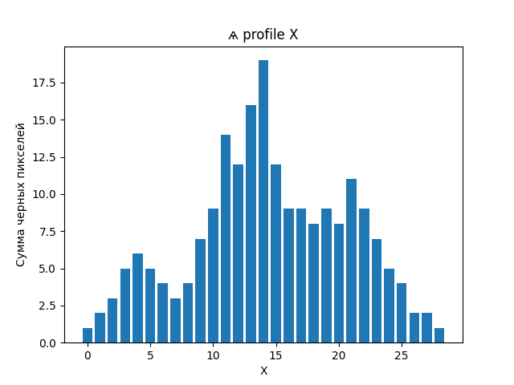

### Профиль Y

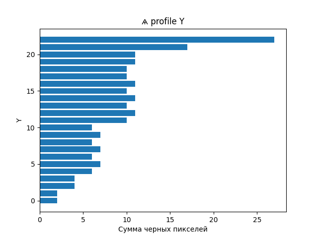

---
## Символ 39 — ѫ

### Изображение символа

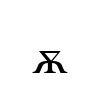

### Скалярные характеристики

| Признак | Значение |
|---|---:|
| Вес 1-й четверти | 60 |
| Вес 2-й четверти | 41 |
| Вес 3-й четверти | 88 |
| Вес 4-й четверти | 88 |
| Удельный вес 1-й четверти | 0.320856 |
| Удельный вес 2-й четверти | 0.219251 |
| Удельный вес 3-й четверти | 0.470588 |
| Удельный вес 4-й четверти | 0.470588 |
| Координата центра тяжести X | 16.194946 |
| Координата центра тяжести Y | 11.895307 |
| Нормированная координата X | 0.476322 |
| Нормированная координата Y | 0.540696 |
| Осевой момент инерции Ix | 13013.963899 |
| Осевой момент инерции Iy | 16123.472924 |
| Нормированный момент инерции Ix | 17.398347 |
| Нормированный момент инерции Iy | 21.555445 |

### Профиль X

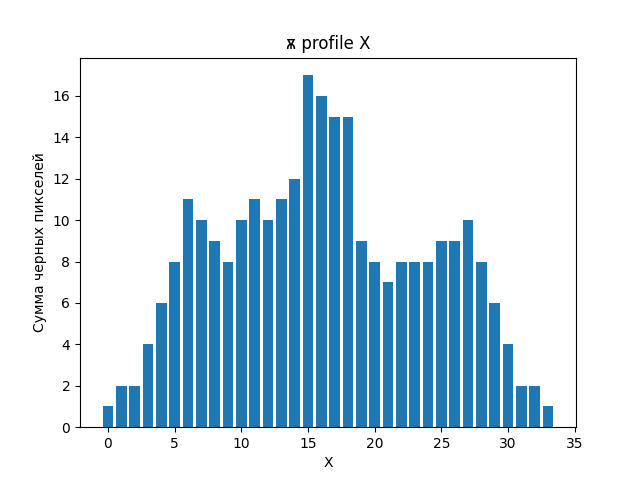

### Профиль Y

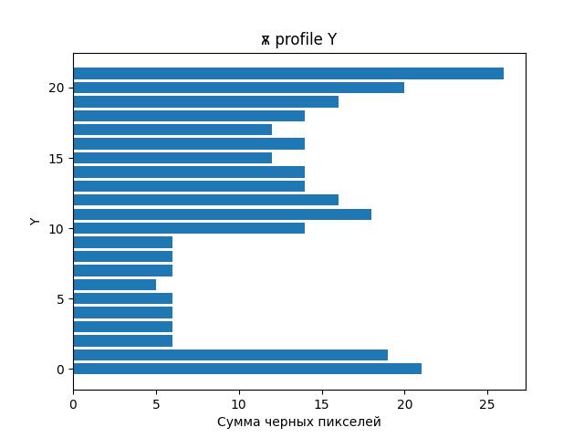

---
