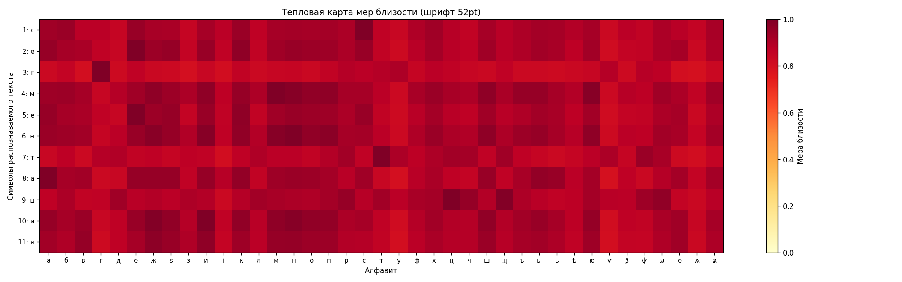
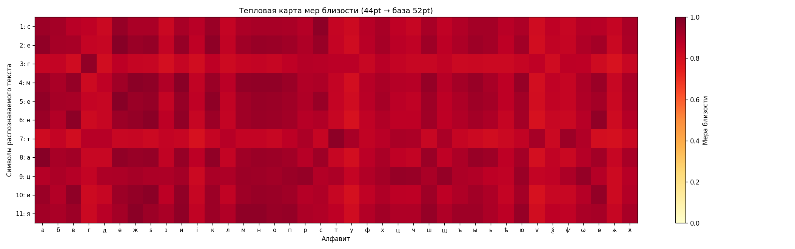
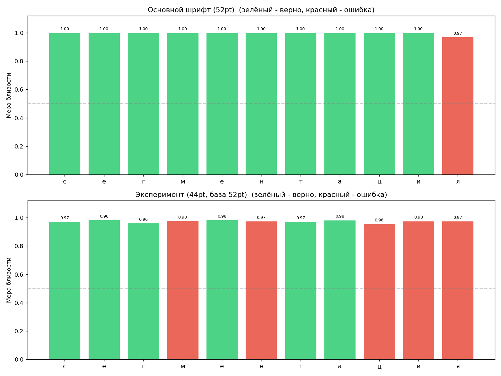

# Лабораторная работа №7

---

## Классификация на основе признаков, анализ профилей

---

**Вариант 5**

### Цель работы

Реализовать расчет меры близости изображений символов на основе признаков, рассчитать меру близости со всеми символами в алфавите, распознать строку и символы в ней и сравнить с исходной поледовательностью символов.

---

## Эксперимент 1. Шрифт 52 (основной)

### Исходная строка

### Распознанная последовательность

`сегментациж`

Количество ошибок: `1` \
Точность: `90.9%` 

### Тепловая карта мер близости

Гипотезы близости символов сохранены в файл `hypotheses_main.txt`

---

## Эксперимент 2. Шрифт 44

### Исходная строка

### Распознанная последовательность

`сегиеѕтаѡѕж`

Количество ошибок: `5` \
Точность: `54.5%`

### Тепловая карта мер близости

Гипотезы близости символов сохранены в файл `hypotheses_experiment.txt`

---

## Результаты 

В результате смены размера шрифта на 44 при сохранении признаков другого точность распознавания упала на `36.4%`

