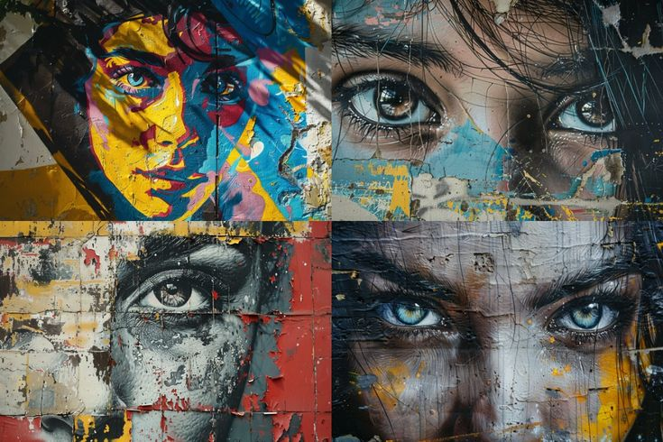
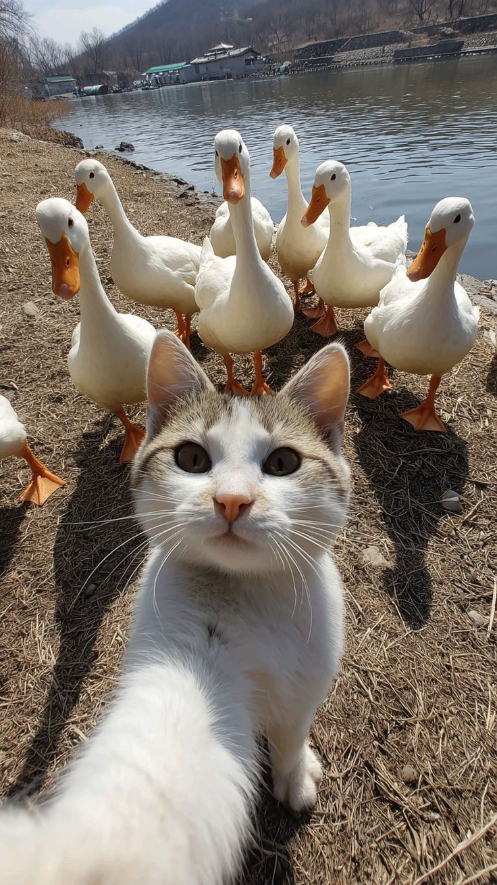
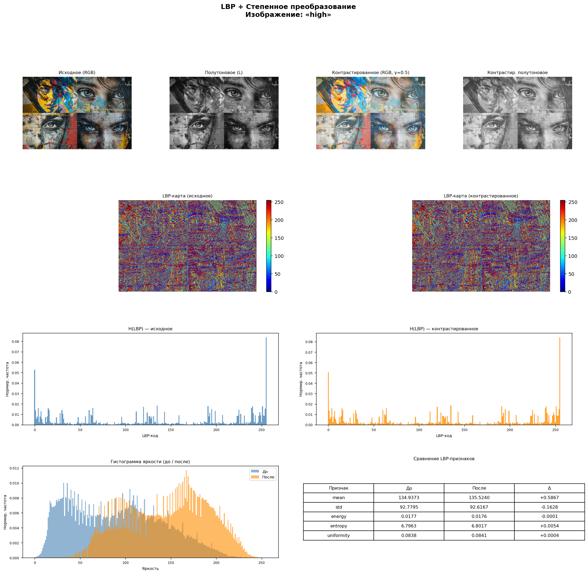
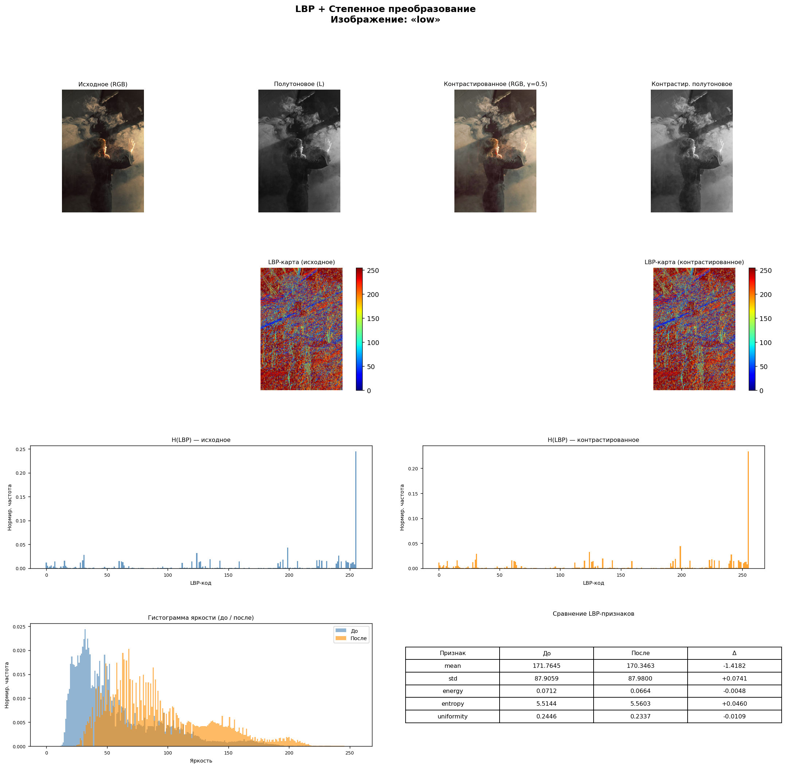
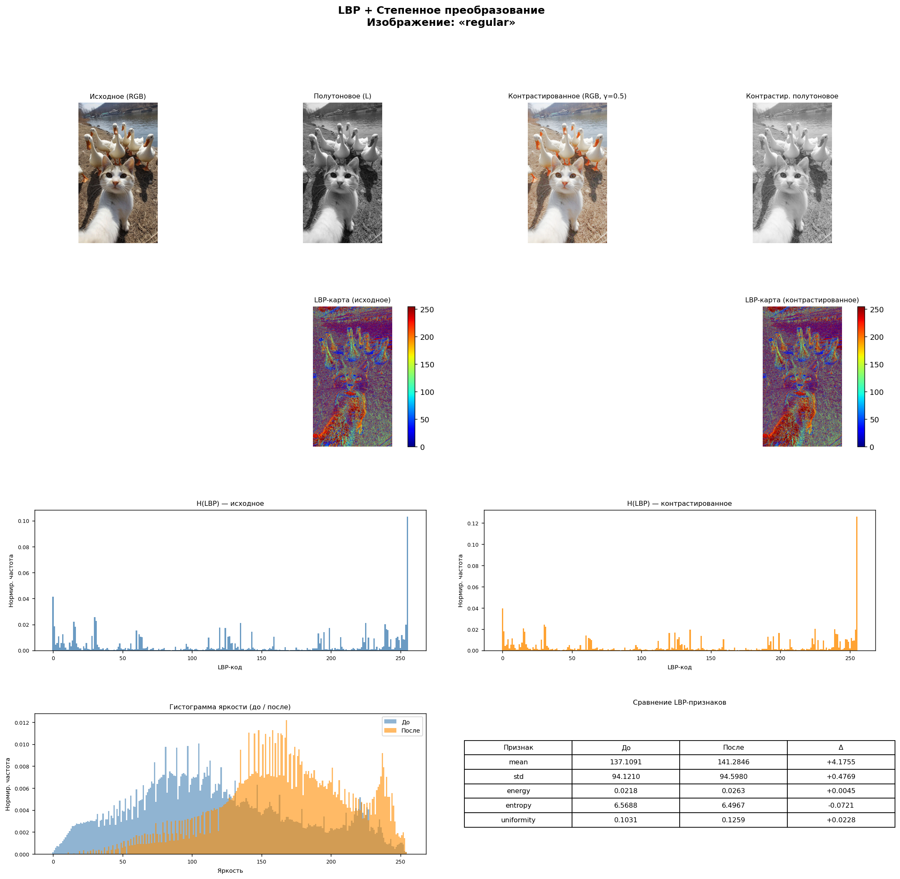
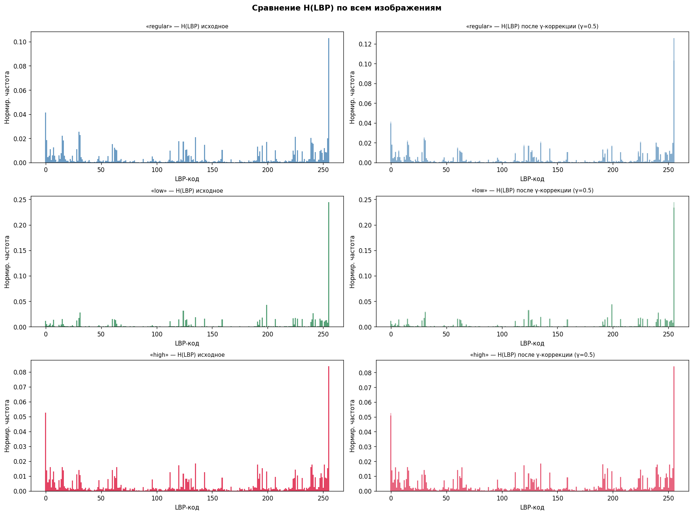

# Лабораторная работа №8

---

## Текстурный анализ и контрастирование

---

**Вариант 5**

---

### Цель работы

Построить матрицу и рассчитать признаки для разных изображений, визуализировать матрицу в виде столбчатой диаграммы для LBP, применить метод преобразования яркости к исходным изображениям, рассчитать гистограммы до и после преобразований, сравнить текстурные признаки для исходных и контрастированных изображений.

---

## Исходные изображения

### Высоконтрастное изображение

### Низконтрастное изображение

### Обычное изображение

---

## Результаты

### Высоконтрастное изображение

### Низкоконтрастное изображение

### Обычное изображение

### Сравнение по всем изображениям

---

## Вывод

В данной лабораторной работе:
- Реализован метод анализа текстур LBP, построены гистограммы признаков
- Выполнено степенное преобразование яркости полутонового изображения
- Проанализированы изменения гистограмм яркости и LBP-признаков
- Проведено сравнение по всем изображениям
