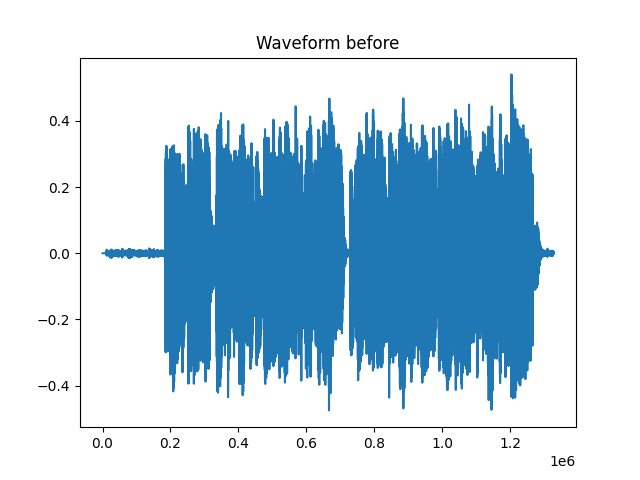
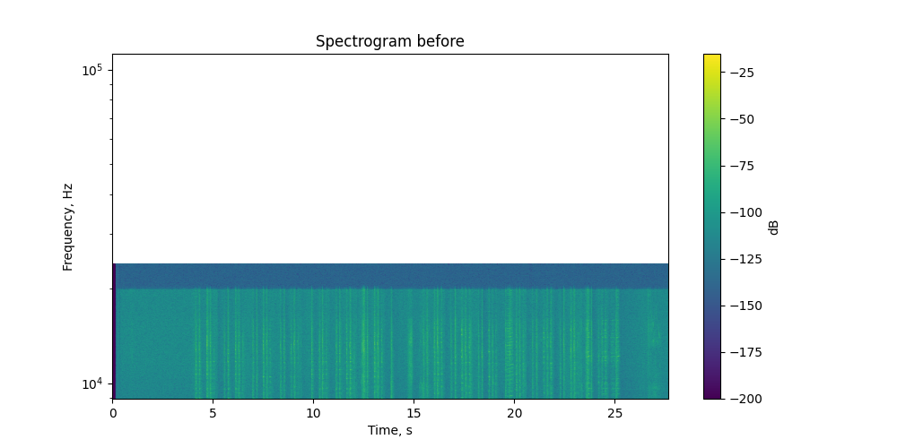
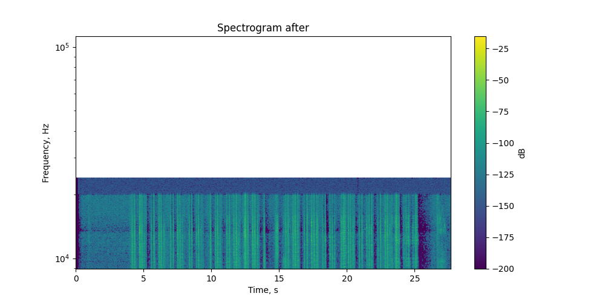

# Лабораторная работа №9

## Анализ шума

### Цель работы

Исследовать шум в аудиозаписи музыкального инструмента, построить спектрограмму сигнала, оценить уровень шума, выполнить его подавление и определить моменты времени, в которых энергия сигнала максимальна в заданных временных и частотных окрестностях.

### Исходные данные

В качестве исходных данных использовалась аудиозапись гитары в формате `.wav`.

## Осциллограммы сигнала

### Исходный сигнал:

### Сигнал после подавления шума:

---

## Спектрограммы сигнала

### Спектрограмма до обработки:

### Спектрограмма после обработки:

---

## Оценка уровня шума

В ходе работы были получены следующие результаты:

* **SNR до обработки:** `~30,01 dB`
* **SNR после обработки:** `~29,90 dB`

После применения спектрального вычитания наблюдается снижение отношения сигнал/шум. Это может быть связано с тем, что при подавлении шума были частично искажены компоненты полезного сигнала, а также возникли дополнительные артефакты обработки (так называемый «музыкальный шум»).

Таким образом, несмотря на визуальное уменьшение шума на спектрограмме, количественная оценка SNR показывает ухудшение качества сигнала, что свидетельствует о необходимости более точной настройки параметров алгоритма.

---

## Моменты времени с максимальной энергией

Были найдены временные интервалы и частотные полосы, в которых энергия сигнала максимальна.

### Наиболее энергетически выраженные участки

1. `t = [8.6; 8.7] c`, `f = [200; 250] Гц`, `E ≈ 0.230`
2. `t = [18.4; 18.5] c`, `f = [200; 250] Гц`, `E ≈ 0.226`
3. `t = [22.0; 22.1] c`, `f = [200; 250] Гц`, `E ≈ 0.211`
4. `t = [5.2; 5.3] c`, `f = [200; 250] Гц`, `E ≈ 0.208`
5. `t = [7.2; 7.3] c`, `f = [200; 250] Гц`, `E ≈ 0.181`

Полный список найденных максимумов был сохранён в файл:

`./output/energy_peaks.csv`

---

## Восстановленный аудиофайл

После подавления шума был сохранён восстановленный аудиосигнал:

`./output/denoised.wav`

---

## Вывод

В ходе лабораторной работы были исследованы методы анализа и подавления шума в аудиосигнале.

Реализовано построение спектрограммы, оценка спектра шума, подавление шума методом спектрального вычитания и анализ энергетических характеристик сигнала.
